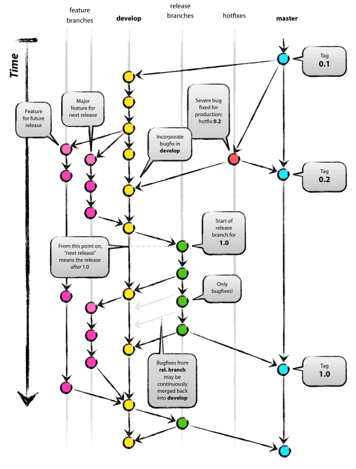

# 👻Today I Learend
Today I Learned
<details>
<details>
<summary>😲2022년 07월 05일😲:🖥 문법 배웠어용 🖥</summary>

## 마크다운 문법 -Heading

- Heading은 문서의 제목이나 소제목으로 사용
  - **#의 개수에 따라 대응되는 수준(Heading level)이 있으며, h1 ~ h6까지 표현 가능**
  - **문서의 구조를 위해 작성되며 글자 크기를 조절하기 위해 사용되어서는 안됨**
    


[참조](https://www.markdownguide.org/basic-syntax/#headings)

## 마크다운 문법 -List

- List는 순서가 있는 리스트(ol)와 순서가 없는 리스트(ul)로 구성
  - **순서가 있는 ol 설명**
    


  - **순서가 없는 ul 설명**
    


[참조](https://www.markdownguide.org/basic-syntax/#lists-1)

## 마크다운 문법 -Fenced Code block

- **코드 블록은 backtick 기호 3개를 활용하여 작성(```)**

- **코드 블록에 특정 언어를 명시하면 Syntax Highlighting 적용 가능**

  >일부 환경에서는 적용이 되지 않을 수 있음
  >


  >


[참조](https://www.markdownguide.org/extended-syntax/#fenced-code-blocks)

## 마크다운 문법 – Inline Code block

- 코드 블록은 backtick 기호 1개를 인라인에 활용하여 작성(`)
  


[참조](https://www.markdownguide.org/basic-syntax/#code)

## 마크다운 문법 – Blockquotes (인용문)

- ">"를 통해 인용문을 작성

>


[참조](https://www.markdownguide.org/basic-syntax/#blockquotes-1)

## 마크다운 문법 – 이미지

- 을 통해 이미지를 사용 가능
  - 특정 파일들 포함하여 연결 시킬 수도 있음

## 마크다운 문법 – text 강조

- 굵게(bold), 기울임(Italic)을 통해 특정 글자들을 강조

  - **굵게(bold)**
  


  - **기울임(Italic))**
    
    </details>

<details>
<summary>🖥2022년 07월 06일🖥: 🤔Git??🤔</summary>

# Interface

인터페이스 : 무언가를 조작하는 전면


### GUI (Graphic User Interface)

: 그래픽으로 유저가 조작한다.

  - `새로 만들기` > `폴더`	

    *이 대상에 이름이 'test1'인 폴더가 이미 있습니다.* 

    

### CLI (Command Line Interface)

: 명령을 줄단위로 조작한다. 

- Windows - CMD, Powershell / MacOS - Terminal

- 명령 프롬프트에서 `$ mkdir 폴더명` 입력

  *mkdir: cannot create directory 'test1': File exists*


# 디렉토리 관리

디렉토리 (directory) : 폴더

$ 뒤에 명령어를 입력하여 사용


### CLI 기초 명령어

- `pwd` (*print working directory*) : 현재 디렉토리 출력
- `cd` `____` (*change directory*) : 디렉토리 이동
  - `폴더명`
  - `.` : 현재 디렉토리
  - `..` : 상위 디렉토리
- `ls` (*list*) : 목록
- `mkdir` `폴더명` (*make directory*) : 디렉토리 생성
- `rm` `파일명` (*remove*) : 파일 제거
- `rm -r` `폴더명` : 디렉토리 제거
  - `-r` : 반복
    - 디렉토리 제거의 경우 디렉토리 안의 모든 파일을 지워야 디렉토리가 제거되므로 -r을 사용함
- `touch` : 0바이트의 빈 파일 생성. 파일의 날짜와 시간을 수정 
- `첫 글자` + `Tab` : 자동완성
- `clear` / `ctrl` + `l` : 전체 삭제


# 버전 관리

버전 (Version) : 컴퓨터 소프트웨어의 특정 상태

버전 관리 : 동일 정보에 대한 여러 버전을 관리하는 것

- 버전 간 차이(diff)와 수정 이유를 메세지로 남길 수 있음 = 커밋 메세지
- 현대 파일들을 안전한 상태로 과거 모습 그대로 복원 가능 (반대의 경우 O)


### 분산 버전 관리 시스템 (DVCS)

- 중앙 집중식 버전 관리 시스템은 중앙에서 버전을 관리하고 파일을 받아서 사용한다
- 분산 버전 관리 시스템은 원격 저장소(Remote Repository)를 통하여 협업하고, 모든 히스토리를 클라이언트들이 공유한다


# Git 

### 개요

분산 버전 관리 시스템으로 코드의 버전을 관리하는 도구 

- 2005년 리눅스 커널을 위한 도구로 리누스 토르발스가 개발

- 컴퓨터 파일의 변경사항을 추적하고 여러 명의 사용자들 간에 해당 파일들의 작업을 조율


### 특징

- Git은 데이터를 파일 시스템의 스냅샷으로 관리하며 크기가 매우 작다
- 파일이 달라지지 않으면 성능을 위해 파일을 새로 저장하지 않는다
- 기존의 델타 기반 버전 관리 시스템과 가장 큰 차이를 가진다


## 기본 흐름 

1. 작업을 하고
2. 변경된 파일을 모아 (add) 
3. 버전으로 남긴다 (commit)


Working Directory → Staging area → Repository

(Untracked)―――→ (Staged) ――→ (Commited)

- Working Directory : 파일의 변경사항이 있는 공간

- Staging Area : 버전으로 기록하기 위한 파일 변경사항의 목록이자 해당 파일들이 모이는 임시 공간

- Repository : 커밋(버전)들이 기록되는 공간


커밋 = SW의 경우 반드시 작동 가능한 상태여야 함

→ 임시저장용으로 사용하지 말 것!


### Working Directory (Untracked)

`$ git init`

: **repository를 생성**하는 명령어

- 디렉토리 내에 **.git** 이라는 숨김 폴더를 생성
- (master) : git으로 관리되고 있는 폴더
- `$ git unit` 을 선언하기 전 반드시 대상 디렉토리 경로 확인


### Staging Area (Staged)

`$ git add <file>`

: working directory 상의 변경 내용을 **staging area에 추가**하는 명령어 

디렉토리 내 요소 전체를 staged 상태로 만들 때에는 파일명 대신 `.` (현재 디렉토리) 사용 가능

- untracked → staged
- modified → staged


### Repository (Commited)

`$ git commit -m '<커밋메세지>'`

: staged 상태의 파일들을 커밋을 통해 **버전으로 기록(=커밋)**하는 명령어

- SHA-1 해시를 사용하여 40자 길이의 체크섬을 생성하고, 이를 통해 고유한 커밋을 표기
- 커밋 메시지는 변경 사항을 알아볼 수 있도록 명확하게 작성


### Status 

`$ git status`

: **현재 상태를 확인**하는 명령어 

- Git 저장소에 있는 **파일의 상태**를 확인하기 위하여 사용

  - Untracked Files

  - Changes not staged for commit

  - Changes to be comitted

  - Nothing to commit, working tree clean

    


##### $ git status 로 확인할 수 있는 파일의 상태 

- Tracked : 이전부터 버전으로 관리되고 있는 파일

  - Unmodified : git status에 나타나지 않음
  - Modified : Changes not staged for commit 
  - Staged : Changes to be commited

- Untracked : 버전으로 관리된 적 없는 파일 (파일을 새로 만든 경우)

  

  - modified : 파일이 수정된 상태 


  (add 명령어를 통하여 Staging Area로)

  - staged : 수정된 파일을 곧 커밋할 것이라고 표시한 상태 


  (commit 명령어를 통해 Repository로)

  - commited : 커밋이 된 상태


### Log

`$ git log` 

: 현재 저장소에 기록된 **커밋**을 조회(=**버전 확인**)

- 다양한 옵션을 통해 로그를 조회할 수 있음

  ​	`$ git log` `-1` : 직전 커밋을 조회 

  ​	`$ git log` `-oneline` : 한 줄로 표시

  ​	`$ git log` `-2 --oneline` : 최근 두 커밋을 한 줄로 표시


# GitHub

**원격 저장소** (Remote Repository) : 네트워크를 활용한 저장소

-  *GitHub, GitLab, Bitbucket*
- Git과 같이 GitHub도 **버전**을 관리한다.


## 기본 흐름

1. 원격 저장소를 만들고 저장소 설정을 한다 `$ git remote add`
2. 로컬 저장소의 버전을 원격 저장소로 보낸다 `$ git push`
3. 원격 저장소의 버전을 로컬 저장소로 가져온다 `$ git pull`


원격 저장소의 주소

https://`github.com`/`GitHubUsername`/`RepositoryName`.git

*[My TIL Repository](https://github.com/soyolee-dev/TIL.git)*


### Remote  

`$ git` `remote` `add origin` ` <url.git>`

- `$ git` : Git에게 명령
- `remote` `add origin` : 원격 저장소를 origin으로 추가
  - 일반적으로 origin으로 사용


`$ git` `remote` `-v` : 원격 저장소 정보 확인

`$ git` `remote` `rm` `<원격 저장소 이름>` : 원격 저장소 삭제


### Push

`$ git push` `<원격 저장소 이름>` `<브랜치 이름>`

- 원격 저장소로 로컬 저장소 변경 사항(commit)을 올림(push)
- 로컬 폴더의 파일/폴더가 아닌 저장소의 **커밋**(버전)이 올라감


#### Push Error

```bash 
! [rejected]			master -> master (fetch first)

error: failed to push some refs to 'url'
```

- 로컬-원격 저장소 간 커밋 이력이 다른 경우 발생
- 원격 저장소의 커밋을 원격 


### Pull

`$ git pull` `<원격 저장소 이름>` `<브랜치 이름>`

- 원격 저장소로부터 변경된 내역을 받아와서 이력을 병합


### Clone

`$ git clone` `<url>`

- 원격 저장소를 복제하여 모든 버전을 가져옴

- 원격 저장소 이름의 폴더로 이동해서 활용

  


## 프로젝트에서의 활용

- **init** : 로컬에서 새로운 프로젝트를 시작

- **push** : 내가 한 로컬 프로젝트 개발 공유

- **pull** : 원격 저장소의 커밋 가져오기

​				*프로젝트 개발 중 다른 사람의 커밋 받아오기*

- **clone** : 원격 저장소를 복제

​				*원격에 있는 프로젝트 시작, 협업 프로젝트, 외부 오픈소스 참여, Git 저장소를 GitHub에서 생성 후 시작...*


## Git 파일 관리 심화

### .gitignore 

- 일반적인 개발 프로젝트에서 버전 관리와 관계 없는 파일이나 디렉토리가 발생

  - [gitignore.io](https://github.com/github/gitignore)에서 개발 언어, 개발 환경(OS, IDE) 등을 설정하여 파일을 생성할 수 있다

- Git 저장소에 **.gitignore 파일을 생성**하여 해당 내용을 관리

  - 특정 파일 : *a.txt* (모든 a.txt) 	

  ​					*test/a.txt* (test 폴더의 a.txt)

  - 특정 디렉토리 : */my_secret*
  - 특정 확장자 : **.exe*
  - 예외 처리 : ***!**b.exe*
  </details>
  
  <details>
  <summary>🌤 2022년 07월 07일 🌤 :🌊 Git Flow 🌊</summary>
  ## 2022년07월07일


```bash
$ git log --oneline
```

> commit 을 몇 개 한지, 간단하게 확인 가능


```bash
$ git checkout `해시값`
```

> 서버 관리 롤백 가능. commit을 했다면 과거 시점으로 돌아가 복구 가능함
>
> `& git log` 로 확인 후 원하는 시점 선택


**📌 주의 : 원격 저장소에서 자체적인 수정 금지!!!**

​	**해결 방법? : 원격 저장소에 있는 파일을 수정하고 싶으면, <u>로컬 저장소에서 파일 수정 -> commit -> (원격저장소로) push</u>**


**⭐️ Code 클론 시 압축(ZIP)과 https copy의 차이?**

: 압축(ZIP)은 최신 버전의 파일/폴더만 가지고 오는 것, https copy는 git 저장소를 가지고 오는 것

```bash
$ git clone '복사한 git https 주소' 

# 주소 예시 : https://github.com/HYUNSIK-JI/TIL.git
```

> https copy로 클론 하는 것이 분산버전관리를 활용하는 방법이다.
>
> 압축(ZIP)은 단지 파일만 내려 받고 싶은 경우임.


**📌 클론 이후 추가 변동 사항이 생겼다면?**

```bash
$ git pull origin master
```

> 이 코드로 원격저장소에서 로컬저장소로 받아오자 !
>
> 당연하지만, commit 후 push는 불가능하다.


### Git Flow

Git을 활용하여 협업하는 흐름으로 branch를 활용하는 전략을 의미합니다.

가장 대표적으로 활용되는 전략은 다음과 같습니다.




|      branch      |                          주요 특징                           |               예시                |
| :--------------: | :----------------------------------------------------------: | :-------------------------------: |
|   master(main)   |                   *배포 가능한 상태의 코드                   |    LOL 클라이언트 라이브 버전     |
|  develop(main)   | *feature branch로 나누어지거나, 발생된 버그 수정 등 개발 진행 *개발 이후 release branch로 갈라짐 |       다음 패치를 위한 개발       |
| feature branches | 기능별 개발 브랜치 *기능이 반영 되거나 드랍되는 경우 브랜치 삭제 | 개발시 기능별 예) 드래곤 업데이트 |
| release branches | 개발 완료 이후 QA/Test 등을 통해 얻어진 다음 배포 전 minor bug fix 등 반영 |            9.24a,9.24b            |
|     hotfixes     | 긴급 하게 반영 해야 하는 bug fix *release branch는 다음 버전을 위한 것이라면,hotfix branch는 현재버전을  위한것 |       긴급 패치를 위한 작업       |


### Branch basic **commands**

**1.브랜치 생성**

```bash
(master) $git branch {branch name}
```


**2.브랜치 이동**

```bash
(master) $git checkout {branch name}
```

**3.브랜치 생성 및 이동**

```bash
(master) $git checkout -b {branch name}
```

**4.브랜치 목록**

```bash
(master) $git branch
```

**5.브랜치 삭제**

```bash
(master) $git branch -d {branch name}
```


### Branch merge

*각 branch에서 작업을 한 이후 이력을 합치기 위해서는 일반적으로 merge 명령어를 사용한다.*

*병합을 진행할 때, 만약 서로 다른 이력(commit)에서 동일한 파일을 수정한 경우 충돌이 발생할 수있다*.

*이 경우에는 반드시 직접 수령을 진행 해야 한다.*

*충돌이 발생한 것은 오류가 발생한 것이 아니라 이력이 변경되는 과정에서 반드시 발생할 수있는 것이다.*

### Branch merge -fast-forword ###

**기존 master 브랜치에 변경사항이 없어 단순히 앞으로 이동 **

``` bash
(master) $ git merge feature -a
Updating 54b9314..5429f25
Fast-forward
```


1. *feature-a branch로 이동 후 commit*
2. *master 별도 변경 없음*
3. *master branch로 병합*

### branch merge -merge commit

**기존 master 브랜치에 변경사항이 있어 병합 커밋 발생**

```bash
(master) $ git merge feature -a
Already up to date!
Merge made by the 'recursive' strategy
```


1. *feature-a branch로 이동 후 commit*
2. *master branch commit*
3. *master branch로 병합*


**$ git config --global core.editor "code --wait" 명령문 이후 병합과정 에러**

```bash
## GitHub HYUNSIK-JI/TIL.git에 보내려고 했어요
To https://github.com/HYUNSIK-JI/TIL.git
 ! [rejected]        master -> master (non-fast-forward)

# 실패했음. 에러입니다.
error: failed to push some refs to 'https://github.com/HYUNSIK-JI/TIL.git'

# 해결방안:새로 추가 된 파일을 commit 해준 뒤 push를 하게되면 병합되어서 원격 저장소에 저장!
hint: Updates were rejected because the tip of your current branch is behind
hint: its remote counterpart. Integrate the remote changes (e.g.
hint: 'git pull ...') before pushing again.
hint: See the 'Note about fast-forwards' in 'git push --help' for details.

```


  </details>
  <details>
<summary>😎2022년 07월 11일😎:🖥 코드업 기초 100제 🖥</summary>
[코드업 기초 100제](https://github.com/HYUNSIK-JI/TIL/blob/master/%EC%BD%94%EB%93%9C%EC%97%85/%EC%BD%94%EB%93%9C%EC%97%85%20%EA%B8%B0%EC%B4%88%20100%EC%A0%9C.py)
</details>
  <details>
  <summary>😎2022년 07월 12일😎:🖥 파이썬 기초 문법🖥</summary>
  ## 2022년07월12일


````bash
# ✅제어문(조건문/반복문)

>
> 1. 제어문이란?
> 2. 조건문
> 3. 반복문

## 1. 제어문(Control Statement)

제어문이란?

파이썬은 기본적으로 위에서부터 아래로 순차적으로 명령을 수행

특정 상황에 따라 코드를 선택적으로 실행(분기/조건)하거나 계속하여

실행(반복하는 제어가 필요함)

제어문은 순서도(flow chart)로 표현이 가능

조건문, 반복문


---


## 2. 조건문

조건문은 참/거짓을 판단할 수 있는 조건식과 함께 사용

코드 블록을 실행한 다음, 다음 코드를 실행하는 형식

조건문의 기본 형식

```python
if < expression >;
    # Run this Code block    <- 참일때 실행
else:
    # Run this Code block    <- 거짓일때 실행(선택적, 직접조건X)

+++++++++++++++++++++++++++++++

<예제1>
아래의 순서도를 코드로 나타내세요(pdf 참조)
◇ 부분: 참, 거짓을 확인하는 조건
a = -10
if a >= 0:
    print('양수')   # -10 은 음수이므로 여기는 실행되지 않음
else: 
    print('음수')   # -10 은 음수이므로 여기가 실행됨
print(a)           # 출력되는 결과는 '음수' -10
여기서 Terminal에 $ python 파일명.py 입력해서 결과 얻기

+++++++++++++++++++++++++++++++

<예제2(실습 문제)>
예제1에서 a가 홀수인지 확인하고 싶다면?
[조건문을 통해 변수 num 값의 홀수/짝수 여부를 출력하시오
 *이때 num 은 input을 통해 사용자로부터 입력 받으시오]
◇ 부분: 2를 나눈 나머지가 1인지?
num = input()
print(num)              #input을 제대로 받고 있는지 반드시 확인!
print(num, type(num))   #num의 타입이 문자열인지, 숫자인지 확인
이때 <class 'str'> 즉, 문자열이라는 결과가 출력되기에
숫자(정수) 결과를 얻기 위해 아래와 같이 코드를 수정해야 함(형 변환)
num = int(input())

if num % 2 == 1:
    print('홀수')
else:
    print('짝수')
여기서 Terminal에 $ python 파일명.py 입력해서 정상 실행되는지 확인
```


복수조건문

홀수, 짝수가 아니라 여러 구간으로 나누어서 결과를 확인하고 싶을 때

ex) 90점~100점: A, 80점~89점: B, 70점~79점:C ... 를 출력하고 싶을 때!

복수의 조건식을 활용할 경우 **elif**를 활용하여 표현함

```python
if <expression>:
    # Code block
elif <expression>:
    # Code block
elif <expression>:
    # Code block
else:
    # Code block
    
+++++++++++++++++++++++++++++++

<실습문제>
다음 미세먼지 농도에 따른 등급일 때,
dust 값에 따라 등급을 출력하는 조건식을 작성하시오.
dust = 100
# dust 가 150보다 크면, 매우 나쁨
if dust > 150:
    print('매우 나쁨')
#          80보다 크면, 나쁨
elif dust > 80:
    print('나쁨')
#          30보다 크면, 보통
elif dust > 30:
    print('보통')
# 좋음
else:
    print('좋음')
여기서 Terminal에 $ python 파일명.py 입력해서 결과 얻기

※ 위에서 주의해야 하는 실수! ※
 elif 쓰다보니 else 에도 조건을 추가해버림
 그러나 else 는 위의 조건을 제외한 나머지 전부기 때문에
 절대로 추가적인 조건문 쓰면 안됨!
 심지어 else 는 상황에 따라 생략해도 결과가 출력됨
```


중첩조건문

조건문을 다른 조건문에 중첩되어 사용할 수 있음

```python
if <expression>:
        # Code block
    if <expression>:
        # Code block
else:
        # Code block

+++++++++++++++++++++++++++++++
        
<실습문제>
(pdf 참조)
dust = -10

if dust > 150:
    print('매우 나쁨')
elif dust > 80:
    print('나쁨')
elif dust > 30:
    print('보통')
else:
    if dust < 0:
        print('음수 값입니다.')
    else: 
    print('좋음')
여기서 Terminal에 $ python 파일명.py 입력해서 결과 얻기
```


조건 표현식(이런게 있다! 정도로만 이해하자)

조건문을 다른 형식으로 쓸 수 있는 방법

조건 표현식을 일반적으로 조건에 따라 값을 정할 때 활용

프린트할 땐 안쓰고, 상황에 따라 

```python
<실습문제>
value = num if num >= 0 else -m

num이 정수일 때,
위 코드는 어떤 코드일까요?
답: 절댓값을 만드는 코드
    
value = num  # 참일 경우
if num >= 0
else -m      # 거짓일 경우

위 코드가 if문이었다면?
num = -10
if num >= 0:
    value = num
else:
    value = -num
print(num, value)    # 양수면 그대로, 음수면 -붙여서

# 조건 표현식 코드: 위의 코드를 아래와 같이 변형
# 원리는 하단 이미지 파일 참조
value = num if num >= 0 else -num
```

---


## 3, 반복문

while, for


반복문

특정 조건에 도달할 때까지 반복되는 일련의 문장

① while 문: 종료조건에 해당하는 코드를 통해 반복문을 종료시켜야 함

② for 문: 반복가능한 객체를 모두 순회하면 종료(별도의 종료조건의 필요없음)

④ 반복제어: break, continue, for-else


while 

while문은 조건식이 참인 경우 반복적으로(=무한) 코드를 실행

조건이 참인 경우 들여쓰기 되어 있는 코드 블록이 실행됨

코드 블록이 모두 실행되고, 다시 조건식을 검사하며 반복적으로 실행됨

while 문은 무한 루프를 하지 않도록 종료조건이 반드시 필요

```python
while <expression>:
    # Code block
    
+++++++++++++++++++++++++++++++
    
<예제>
아래의 순서도를 코드로 나타내세요(pdf 참조)
# Q: 하단의 코드는 몇 번 반복될까? / A: 5회
a = 0
while a < 5:    # 종료조건에 해당하는 부분
    print(a)
    a += 1      # a = a+1 의미
print('끝')

+++++++++++++++++++++++++++++++

<실습문제>
1부터 사용자가 입력한 양의 정수까지 총합을 구하는 코드를 작성하시오

# <풀이 절차>
# 매 회 n 이 1씩 증가해야하고
# 매 회 result 에는 n을 더해야함
# 종료는 n = user_input 보다 커졌을 때
# (True일땐 작거나 같을 때)

n = 0                       # 처음 시작 값
result = 0                  # 0부터 더하기 위해서
user_input = int(input())   # user_input 값
while n <= user_input:
    result += n
    n += 1
print(result)
여기서 Terminal에 $ python 파일명.py 입력해서 정상 실행되는지 확인

+++++++++++++++++++++++++++++++

# 실습문제 Q: 그냥 n<user_input 하면 안되나요?
# 실습문제 A: (하단의 상황1, 상황2 비교해보기)

# 새로운 상황! n < user_input 를 아래와 같은 코드로 작성
n = 0
result = 0
user_input = int(input())
while n < user_input:
    n += 1
    result += n
print(result)
여기서 Terminal에 $ python 파일명.py 입력해서 정상 실행되는지 확인
처음의 실습문제 풀이와 동일한 값이 출력되는지 확인!

# [상황1,2 비교] 위 상황들이 실제로 어떻게 진행되는 것인지 디버깅 해보기

상황1)
while n <= user_input:
    print(f'n: {n}, result: {result}')   # 이 코드를 추가
    result += n
    n += 1
print(result)

상황2)
while n < user_input:
    print(f'n: {n}, result: {result}')   # 이 코드를 추가
    n += 1
    result += n
print(result)

# [상황1,2 비교] <- 위의 코드들 사이에 print 추가해서
# 내가 보기 편하게끔 바꿔나가야 함(아래 코드를 순차적으로 확인)
n = 0
result = 0
user_input = int(input())
while n <= user_input:
    print(f'n: {n}, result: {result}')  # 작업상황 확인용 추가코드
    result += n
    n += 1
print(result)

n = 0
result = 0
print('=============')       # 요런 줄을 추가해서 상환1,2 사이 코드 가독성 높임
while n < user_input:
    print(f'n: {n}, result: {result}') # 작업상황 확인용 추가코드
    n += 1
    result += n
print(result)
```


for

for문은 시퀀스(스트링, 튜플, 리스트 ..)를 포함한 순회가능한 객체(iterable)요소를 모두 순회함

처음부터 끝까지 모두 순회하므로 별도의 종료조건이 필요하지 않음

```python
for <변수명> in <반복 가능한 아이(iterable)>:
    # Code block

+++++++++++++++++++++++++++++++
    
<예제>
아래의 순서도를 코드로 나타내세요(pdf 참조)
for fruit in ['apple', 'mango', 'banana']:
    print(fruit)
print('끝')
```


문자열 순회(1)

사용자가 입력한 문자를 한 글자씩 세로로 출력하시오

```python
chars = input()
# hi 출력

for char in chars:
    print(char)
# h
# i 출력
```


문자열 순회(2)

사용자가 입력한 문자를 **range** 를 활용하여 한 글자씩 세로로 출력하시오

위(1)와 동일하지만, index 를 기준으로 순회한다는 특징/장점이 있음

(= 인덱스로 접근해서 씀, 실제 알고리즘 활용할 땐 이 방법을 더 많이 사용)

```python
chars = input()
# hi 출력

# range(len(chars)) 활용!
for idx in range(len(chars)):
    print(chars[idx])
```


enumerate 순회(심화)

튜플을 활용

알고리즘 때 잘 안쓰고, (2) 위주로 많이 사용하게 됨


딕셔너리 순회

딕셔너리는 기본적으로 key를 순회하며, key를 통해 값을 활용

```python
grade = {'john': 80, 'eric': 90}
for name in grade:
    print(name)
    
# john
# eric      이와 같이 키만 출력됨

+++++++++++++++++++++++++++++++

# 위의 상황에서 값과 같이 출력하고 싶다면?

grade = {'john': 80, 'eric': 90}
for name in grade:
    print(name, grades[name])

# john 80
# eric 90    이와 같이 키-값이 같이 출력됨
```


반복문 제어

반복문을 어떻게 멈출 수 있을까?

break: 반복문을 종료

continue: continue 이후의 코드 블록은 수행하지 않고, 다음 반복을 수행

for-else: 끝까지 반복문을 실행한 이후 else문 실행

​                break 통해 중간에 종료되는 경우 else문은 실행되지 않음


break 예시로 이해하기

```python
break문을 만나면 반복문은 종료됨

상황1)
  n = 0
  while True:
      if n == 3:
            break
      print(n)
      n += 1
# 0
# 1
# 2 출력
        
상황2)
  for i in range(10):
        if i > 1:
            print('0과 1만 필요해!')
            break
        print(i)
# 0
# 1
# 0과 1만 필요해!     출력
```


continue 예시로 이해하기

```python
continue 이후의 코드 블록은 수행하지 않고, 다음 반복을 수행

for i in range(6):
    if i % 2 == 0
        continue
    print(i)
# 1
# 3
# 5  출력
```


for-else 예시로 이해하기

```python
상황1)
  for char in 'apple':
      if char == 'b':
          print('b!')
          break
  else:
      print('b가 없습니다.')
# b가 없습니다.  출력
    
상황2)
  for char in 'banana'
      if char == 'b'
          print('b!')
          break
  else:
      print('b가 없습니다.')
# b!  출력
```


````
  </details>
  <details>
  <summary>😅2022년 07월 13일😅:🎄 세그먼트 트리 와 파이썬 함수 🎄</summary>
  [세그먼트 트리](https://www.acmicpc.net/problem/10868)
  이 문제는 세그먼트 트리를 사용하여 풀어야한다. 그런데 처음에 세그먼트 트리에 대하여 잘 몰라서 검색을 통해 세그 먼트 트리를 먼저 공부하였다.

```markdown
# 세그먼트 트리란?
세그먼트 트리란 이진 탐색과 비슷하게 구간을 반으로 쪼개어가면서 그 구간에서의 특정 값을 저장해놓은 자료구조이다.
```

위의 최솟값을 구하는 문제를 풀때 구간이 정해지고 그때마다 구간을 모두 검색해서 최솟값을 찾을수도 있다. 이러면 최솟값을 찾는데 O(n)이고 총 m번의 입력에 따른 최솟값을 구해줘야하니 O(n*m) 즉,시간복잡도를 O(n^2)이라고 볼수 있다. 그러나 세그먼트 트리를 사용한다면 최솟값을 구하는데 O(logN)의

시간복잡도로 시간복잡도를 O(NlogN)으로 준다. 이 방법은 시간복잡도는 줄지만 공간복잡도 는 위의 방법보다는 크다는 특징이 있다.


## 문제 해결 방법

1. 주어지는 배열에 대하여 세그먼트 트리를 만들어주고 여기서 세그먼트 트리의 각각의 값에 그 구간의 최솟값을 저장
2. 이렇게 트리를 다 만들어 놓고나서 a,b를 입력받으면 트리를 탐색하면서 a~b구간의 최솟값을 구해준다.


트리의 높이:2^ceil(log(n,2))


노드 개수:2*(2^ceil(log(n,2)))


```python
# 10868번 최솟값

import sys
from math import ceil,log

input=sys.stdin.readline

def mininum(left,right,start,end,node):
    if left>end or right<start: return 1000000000
    if left<=start and right>=end: return graph[node]
    mid=(start+end)//2
    return min(mininum(left,right,start,mid,node*2),mininum(left,right,mid+1,end,node*2+1))
# 세그먼트 트리 초기화
def init(size):
    for i in range(size-1,0,-1):
        graph[i]=min(graph[i*2],graph[2*i+1])

n,m=map(int,input().split())

#세그먼트 트리 사이즈 계산
size=2**ceil(log(n,2)) #세그먼트 높이 계산
size_max=2*size#세그먼트 트리 노드의 갯수

graph=[1000000000]*size_max#최솟값 초기화
for i in range(n):
    graph[size+i]=int(input())
init(size)

for _ in range(m):
    s,e=map(int,input().split())
    #주어지는 s,e는 index가 아니라 번째 수임을 주의해야한다.
    print(mininum(s-1,e-1,0,size-1,1))
```
 ## 📦 함수(function)

* 특정한 기능을 하는 코드의 조각

* 특정 명령을 수행하는 코드를 매번 다시 작성하지 않고, 필요 시에만 호출하여 간편히 사용

  <br>

## 🤔 왜 우리는 함수를 사용할까?

* Decomposition : 기능을 분해해서 재사용 가능

  ``` python
  # 코드
  numbers = [1, 10, 100]
  result = 0
  cnt = 0
  for number in numbers:
    result += number # 합을 구하는 기능
    cnt += 1 # 카운트 기능
  print(result/cnt)
  
  # 함수
  print(sum(numbers)/len(numbers)) # 함수로 분리해서 활용, 그 결과 편해지고 간결해짐
  ```

* Abstraction : 복잡한 내용을 숨기고, 기능에 집중하여 사용할 수 있음.(블랙박스) 재사용성, 가독성, 생산성

  ``` python
  print('happy!')
  # 우리가 출력을 함수 없이 구현하려면 얼마나 복잡할까?
  ```

<br>

## 함수의 정의

* 특정한 기능을 하는 코드의 조각

* 특정 명령을 수행하는 코드를 매번 다시 작성하지 않고, 필요 시에만 호출하여 간편히 사용

* 사용자 함수(Custom Function)

  * 구현되어 있는 함수가 없는 경우, 사용자가 직접 함수를 작성 가능하다.

    ``` python
    def add(a, b): # a, b를 더하는 함수를 선언
      return a+b
    
    add(5, 10) # 사용
    ```

<br>

#### 📌 함수의 기본 구조

* 선언과 호출(define & call)
* 입력(Input)
* 범위(Scope)
* 결과값(Output)

<br>

#### 📌 선언과 호출(define & call)

* 선언은 def 키워드를 활용한다.
* 들여쓰기를 통해 Function body(실행될 코드 블록)를 작성
* 함수는 파라미터를 넘겨줄 수 있음
* 함수는 동작 후에 return을 통해 결과값을 전달함

``` python
def foo(): # 함수의 선언
  return True
foo() # 함수의 호출

def add(x,y):
  return x + y
add(2,3) # 5
```

<br>

#### 📌 예시

``` python
num1 = 0
num2 = 1

def func1(a, b): # 3. 0 + 5 = 5
  return a + b

def func2(a, b): # 4. 5 - 1 = 4
  return a - b

def func3(a, b): # 2. 호출되는 함수 확인
  return func1(a, 5) + func2(5, b) # 5. 5 + 4 = 9

result = func3(num1, num2) # 1. 호출
print(result) # 6. 9
```

<br>

#### 📌 함수의 결과값(output)

#### return

* 함수는 반드시 값을 하나만 return한다.
  * 명시적 return이 없는 경우에도 None을 반환한다.
* 함수는 return과 동시에 실행이 종료된다.

``` python
def minus_and_product(x,y):
  return x - y
	return x * y
# x - y 만 실행이 되고 함수는 종료된다.

def minus_and_product(x,y):
  return x - y, x * y

minus_and_product(4, 5)
# -> (-1, 20) 튜플 반환이 됨
```

<br>

#### 📌 함수의 입력(Input)

* Parameter : 함수를 실행할 때, 함수 내부에서 사용되는 식별자
* Argument : 함수를 호출 할 때, 넣어주는 값
  * 필수 Argument : 반드시 전달되어야 하는 argument
  * 선택 Argument : 값을 전달하지 않아도 되는 경우는 기본 값이 전달

``` python
def function(ham): # parameter : ham
  return ham

function('spam') # argument : spam
```

<br>

#### 📌 Argument

* positional arguments

  * 기본적으로 함수 호출 시 Argument는 위치에 따라 함수 내에 전달됨

    ``` python
    def add(x, y):
      return x + y
    
    add(2, 3)# 2의 위치 x, 3의 위치 y
    ```

* keyword arguments

  * 직접 변수의 이름으로 특정 Argument를 전달할 수 있음

  * Keyword Argument 다음에 Positional Argument를 활용할 수 없음

    ``` python
    def add(x, y):
      return x + y
    
    add(x=2, y=5)
    add(2, y=5)
    ```

* default arguments values

  * 기본값을 지정하여 함수 호출 시 argument 값을 설정하지 않도록 함

  * 정의된 것 보다 더 적은 개수의 argument들로 호출될 수 있음

    ``` python
    def add(x, y=0):
      return x + y
    
    add(2)
    ```

* 정해지지 않은 개수의 arguments

  * 여러개의 Positional Argument를 하나의 필수 parameter로 받아서 사용

  * 몇 개의 Positional Argument를 받을지 모르는 함수를 정의할 때 유용

    ``` python
    def add(*args):
      for args in args:
        print(arg)
        
    add(2)
    add(2, 3, 4, 5) # 이 경우 타입이 tuple로 나옴
    ```

* 정해지지 않은 개수의 keyword arguments

  * 함수가 임의의 개수 Argument를 Keyword Argument로 호출될 수 있도록 지정

  * Argument들은 딕셔너리로 묶여 처리되며, parameter에 **를 붙여 표현한다.

    ``` python
    def family(**kwargs):
      for key, value in kwargs:
        print(key, ":", value)
        
    family(father='John', mother='Jane', me='Jone Jr.')
    ```

<br>

#### 📌 함수의 범위(scope)

* 함수는 코드 내부에 local scope를 생성하며, 그 외의 공간인 global scope로 구분한다.

* scope

  * global scope : 코드 어디에서든 참조할 수 있는 공간
  * local scope : 함수가 만든 scope. 함수 내부에서만 참조 가능

* variable

  * global variable : global scope 내부에 정의된 변수

  * local variable : local scope 내부에 정의된 변수

    ``` python
    def func(): 
      a = 20
      print('local', a)# local scope
      
    func() 
    print('global', a) # global scope
    # NameError : name 'a' is not defined
    ```

<br>

#### 📌 객체 수명주기

* 객체는 각자의 수명주기가 존재
  * built-in scope `(print, sum, len..)`
    * 파이썬이 실행된 이후부터 영원히 유지됨
  * global scope `a=3`
    * 모듈이 호출된 시점 이후 혹은 인터프리터가 끝날 때까지 유지
  * local scope `def ___ a = 1..`
    * 함수가 호출될 때 생성되고, 함수가 종료될 때 까지 유지

<br>

#### 📌 이름 검색 규칙(Name Resolution)

* 파이썬에서 사용되는 이름(식별자)들은 이름공간(namespace)에 저장되어 있음

* 아래와 같은 순서로 이름을 찾아나가며, LEGB Rule이라고 부름

  * Local scope : 함수
  * Enclosed scope : 특정 함수의 상위 함수
  * Global scope : 함수 밖의 변수, Import 모듈
  * Built-in scope : 파이썬 안에 내장되어 있는 함수 또는 속성

* 즉, 함수 내에서는 바깥 Scope의 변수에 접근 가능하나 수정 할 수 없음

  ``` python
  print(sum)
  print(sum(range(2)))
  sum = 5
  print(sum)
  print(sum(range(2)))
  # TypeError TraceBack(most recent call last)
  # 3 sum = 5
  # 4 print(sum)---->
  # 5 print(sum(range(2)))
  # TypeError: 'int' object is not callable
  ```

<br>

## 함수의 응용

#### 📌 map

* 순회 가능한 데이터구조(iterable)의 모든 요소에 함수 적용하고, 그 결과를 map object로 반환

  ``` python
  numbers = ['1', '2', '3']
  new_numbers_2 = map(int, numbers)
  print(list(new_numbers))#[1, 2, 3]
  
  n, m = map(int, input().split())
  # int
  # input() = 타입 : String(문자열)
  # split() = 타입 : list(리스트)
  # input().split = 타입 : list
  # map = 어떤 함수를 반복가능한 것들의 요소에 모두 적용
  # int 함수를 input().split() 리스트의 모든 요소에 적용한 결과 => map object n, m = [10, 20]
  
  def plus10(n):
    return n + 10
  
  numbers = [10, 20, 30]
  new_numbers = list(map(plus10, numbers))
  print(new_numbers)
  #[20, 30, 40]
  ```
</details>
<details>
<summary>😲2022년 07월 14일😲:🖥 파이썬 기초 🖥</summary>
	
	🎯 학습 목표 : Python 기초
	데이터 구조(Data Structure)
	Computer = Calculation + Remember(조작/계산하고 저장)

	✔️ 함수의 기본 구조
	타입.메서드() 
	# 1. '타입' : 누가 -> 2. '()' : What Input -> 3. '결과' : output

	# '타입' 에 대한 이해
	# input(어떠한 타입?⭐️) -> 함수 -> output(어떤 타입?⭐️)
	# 자바와 달리 파이썬은 동적타이핑 언어이기 때문에 의도적으로 어떠한 타입인지 항상 생각해야함 ⭐️

	# input().split()
	# 여기서 input의 결과 타입은 '문자열'

	# [1, 2, 3].append(4)
	# 여기서의 input의 결과 타입은 '리스트'
	메서드(methods)
	<목차>

	------시퀀스------
	문자열(String)
	리스트(List)

	------컬렉션------
	세트(Set)
	딕셔너리(Dictionary)
	1. 문자열(String Type)
	문자들의 나열(sequence of characters)

	모든 문자는 str 타입
	문자열은 작은 따옴표(' ')나 큰 따옴표(" ")를 활용하여 표기

	문자열을 묶을 때 동일한 문장부호 사용
	PEF8에서는 소스코드 내에서 하나의 문장부호를 선택하여 유지하도록 함
	✔️ 문자열 탐색/검증
	문법	설명
	s.find(x)	x의 첫 번째 위치를 반환. 없으면, -1을 반환
	s.index(x)	x의 첫 번째 위치를 반환. 없으면, 오류 발생
	s.isalpha()	알파벳 문자 여부
	*단순 알파벳이 아닌 유니코드 상 Letter (한국어도 포함)
	s.isupper()	대문자 여부
	s.islower()	소문자 여부
	s.istitle()	타이틀 형식 여부
	s.isXXX() 로 작성된 메서드는 대게 boolean type이며, true/false로 문자열 관련 검증 메서드!!!

	.find(x)

	'apple'.find('p')
	# 1
	'apple'.find('k')
	# -1
	'word'.find('w')
	# 0
	.isdecimal() : 주로 숫자 여부 검증에 사용

	✔️ 문자열 변경
	문법	설명
	s.replace(old, new[, count])	바꿀 대상 글자를 새로운 글자로 바꿔서 반환
	s.strip([chars])	공백이나 특정 문자를 제거
	s.split(sep = None, maxsplit = -1)	공백이나 특정 문자를 기준으로 분리
	'separator'.join([iterable])	구분자로 iterable을 합침
	s.capitalize()	가장 첫 번째 글자를 대문자로 변경
	s.title()	'나 공백 이후를 대문자로 변경
	s.upper()	모두 대문자로 변경
	s.lower()	모두 소문자로 변경
	s.swapcase()	대<-> 소문자 서로 변경
	.replace(old, new[,count])
	'coone'.replace('o', 'a')
	# caane
	'wooooowoo'.replace('o', '!', 2)
	# w!!ooowoo
	.strip([chars])
	'     와우!\n'.strip()
	# '와우!'
	'     와우!\n'.lstrip()
	# '와우!\n'
	'     와우!\n'.rstrip()
	# '     와우!'
	'안녕하세요????'.rstrip('?')
	# '와우!\n'
	보통 .lstrip(), .rstrip() 을 따로 사용하기 보단 .stirp()으로 양쪽 공백 지우는데 주로

	.split(sep=None, maxsplit=-1)
	문자열을 특정한 단위로 나눠 **리스트**⭐️로 변환
	sep이 None이거나 지정되지 않으면 연속된 공백문자를 단일한 공백문자로 간주하고, 선행/후행 공백은 빈 문자열에 포함 안 함
	maxsplit이 -1 인 경우에는 제한이 없음
	'a,b,c'.split('_')
	# ['a,b,c']
	'a b c'.split() # 기본 공백
	# ['a', 'b', 'c']
	'separator'.join([iterable])

	반복가능한(iterable) 컨테이너 요소들을 separator(구분자)로 합쳐 문자열 반환
	iterable에 문자열이 아닌 값이 있으면 TypeError 발생
	📌 문자열은 immutable 이므로 스스로 바뀌지 않는다.

	''.join(['3', '5'])
	# 35

	','.join(['홍길동', '김철수'])
	'홍길동,김철수'
	2. 리스트(List)
	변경 가능한 값들의 나열된 자료형

	순서를 가지며, 서로 다른 타입의 요소를 가질 수 있음

	변경 가능하며(mutable), 반복 가능함(iterable)

	항상 대괄호 형태로 정의하며, 요소는 컴마로 구분

	문법	설명
	L.append(x) ⭐️	리스트 마지막에 항목 x를 추가
	L.insert(i, x)	리스트 인덱스 i에 항목 x를 삽입
	L.remove(x)	리스트 가장 왼쪽에 있는 항목(첫 번째) x를 제거
	항목이 존재하지 않을 경우, ValueError
	L.pop() ⭐️	리스트 가장 오른쪽에 있는 **항목(마지막)**을 반환 후 제거
	L.pop(i)	리스트의 인덱스 i에 있는 항목을 반환 후 제거
	L.extend(m)	순회형 m의 모든 항목들의 리스트 끝에 추가(+=과 같은 기능)
	L.index(x, start, end)	리스트에 있는 항목 중 가장 왼쪽에 있는 항목 x의 인덱스를 반환
	L.reverse()	리스트를 거꾸로 정렬
	L.sort() ⭐️	리스트를 정렬(매개변수 이용가능)
	L.count(x) ⭐️	리스트에서 항목 x가 몇 개 존재하는지 갯수를 반환
	.append(x)
	cafe = ['starbucks', 'tomntoms', 'hollys']
	# ['starbucks', 'tomntoms', 'hollys']
	cafe.append('banapresso')
	# ['starbucks', 'tomntoms', 'hollys', 'banapresso']
	.extend(iterable) : 리스트에 ⭐️iterable의 항목을 추가
	cafe = ['starbucks', 'tomntoms', 'hollys']
	# ['starbucks', 'tomntoms', 'hollys']
	cafe.extend(['cafe', 'test'])
	# ['starbucks', 'tomntoms', 'hollys', 'cafe', 'test']
	.insert(i, x) : 정해진 위치 i에 값을 추가
	cafe = ['starbucks', 'tomntoms']
	# ['starbucks', 'tomntoms']
	cafe.insert(0, 'start')
	# ['start', 'starbucks', 'tomntoms']

	# 리스트 길이보다 큰 경우 맨 뒤로 간다
	cafe.insert(10000, 'end')
	# ['starbucks', 'tomntoms', 'end']
	.remove(x) : 리스트에서 값이 x인 것을 삭제
	numbers = [1, 2, 3, 'hi']
	# [1, 2, 3, 'hi']
	numbers.remove('hi')
	# [1, 2, 3]

	# 애초에 삭제할 값이 없는 경우엔 ValueError
	.pop(i) : 정해진 위치 i에 있는 값을 삭제하고, 그 항목을 반환함
	i가 지정되지 않으면, 마지막 항목을 삭제하고 반환
	numbers = ['hi', 1, 2, 3]
	# ['hi', 1, 2, 3]
	pop_number = numbers.pop()
	# ['hi', 1, 2]

	numbers = ['hi', 1, 2, 3]
	# ['hi', 1, 2, 3]
	pop_numbers = numbers.pop(0)
	# 'hi'
	print(numbers)
	# [1, 2, 3]
	.clear() : 모든 항목 삭제
	numbers = [1, 2, 3]
	# [1, 2, 3]
	numbers.clear()
	# []
	✔️ 탐색 및 정렬
	.index(x) : x값을 찾아 해당 Index 값을 반환
	numbers = [1, 2, 3, 4]
	print(numbers)
	# [1, 2, 3, 4]
	print(numbers.index(3))
	# 2
	print(numbers.index(100))
	# ValueError
	.count(x) : 원하는 값의 개수를 반환
	numbers = [1, 2, 3, 1, 1]
	numbers.count(1)
	# 3
	numbers.count(100)
	# 0

	# 리스트를 순회 (for)
	# 값이 1인 것을 count += 1 (if)
	.sort() : 원본 리스트를 정렬함. None 반환, sorted 함수와 비교할 것
	# 예시 1
	numbers = [3, 2, 5, 1]
	result = number.sort()
	print(numbers, result)
	# [1, 2, 3, 5] None 
	# 원본 변경

	# 예시 2
	numbers = [3, 2, 5, 1]
	result = sorted(numbers)
	print(numbers, result)
	# [3, 2, 5, 1] [1, 2, 3, 5]
	# 정렬된 리스트를 반환, 원본 변경 없음
	.reverse() : 순서를 반대로 뒤집음(정렬하는 것이 아님). None 반환
	numbers = [3, 2, 5, 1]
	result = numbers.reverse()
	print(numbers, result)
	# [1, 5, 2, 3] None
	📌 함수와 메서드 구분 방법?

	메서드 : `S.V()` 처럼 '.' 으로 구분

	함수 : '.' 으로 구분 안 됨. sum()  
	3. 세트 메서드 (참고만 하기)
	문법	설명
	s.copy()	세트의 얇은 복사본을 반환
	s.add(x)	항목 x 가 세트s에 없다면 추가
	s.pop()	세트 s에서 랜덤하게 항목을 반환하고, 해당 항목을 제거
	세트가 비어 있을 경우, KeyError
	s.remove(s)	항목 x 를 세트 s에서 삭제
	항목이 존재하지 않을 경우, KeyError
	s.discard(x)	항목 x가 세트 s에 있는 경우, 항목 x를 세트 s에서 삭제
	s.update(t)	세트 t에 있는 모든 항목 중 세트 s에 없는 항목을 추가
	s.clear()	모든 항목을 제거
	s.isdisjoint(t)	세트 s가 세트 t의 서로 같은 항목을 하나라도 갖고 있지 않은 경우, True 반환
	s.issubset(t)	세트 s가 세트 t의 하위 세트인 경우, True 반환
	s.issuperset(t)	세트 s가 세트 t의 상위 세트인 경우, True 반환
	4. 딕셔너리(Dictionary)
	키-값(key-value) 쌍으로 이뤄진 모음(collection)

	키(key)
	불변 자료형만 가능(리스트, 딕셔너리 등은 불가능함)
	값(values)
	어떠한 형태든 관계 없음
	키와 값은 : 로 구분 됩니다. 개별 요소는 , 로 구분됩니다.

	변경 가능하며(mutable), 반복 가능함(iterable)

	딕셔너리는 반복하면 키가 반환됩니다.
	문법	설명
	d.clear()	모든 항목을 제거
	d.copy()	딕셔너리 d의 얕은 복사본을 반환
	d.keys()	딕셔너리 d의 모든 키를 담은 뷰를 반환
	d.values()	딕셔너리 d의 모든 값을 담은 뷰를 반환
	d.items()	딕셔너리 d의 모든 키-값의 쌍을 담은 뷰를 반환
	d.get(k)	키 k의 값을 반환하는데, 키 k가 딕셔너리 d에 없을 경우 None을 반환
	d.get(k, v)	키 k의 값을 반환하는데, 키 k가 딕셔너리 d에 없을 경우 v을 반환
	d.pop(k)	키 k의 값을 반환하는데, 키 k인 항목을 딕셔너리 d에서 삭제하는데,
	키 k가 딕셔너리 d 에 없을 경우 KeyError를 발생
	d.pop(k, v)	키 k 의 값을 반환하고 키 k인 항목을 딕셔너리 d에서 삭제하는데,
	키 k가 딕셔너리 d에 없을 경우 v를 반환
	d.update([other])	딕셔너리 d의 값을 매핑하며 업데이트
	.get(key[,default])
	key를 통해 value를 가져옴
	keyError가 발생하지 않으며, default 값을 설정할 수 있음(기본 : None)
	# 방법 1
	my_dict = {'apple' : '사과', 'banana' : '바나나'}
	my_dict['pineapple']
	# KeyError : 'pineapple'

	# 방법 2
	my_dict = {'apple' : '사과', 'banana' : '바나나'}
	print(my_dict.get('pineapple'))
	# None
	print(my_dict.get('apple'))
	# 사과
	print(my_dict.get('pineapple', 0))
	# 0
	.pop(key[,default]) : key가 딕셔너리에 있으면 제거하고 해당 값 반환
	my_dict = {'apple' : '사과', 'banana' : '바나나'}
	data = my_dict.pop('apple')
	print(data, my_dict)
	# 사과 {'banana' : '바나나'}
	# key가 딕셔너리에 있으면 제거하고 해당 값을 반환
	# 그렇지 않으면 default를 반환
	# default 값이 없으면 KeyError
	.update([other]) : 값을 제공하는 key, value로 덮어씁니다
	my_dict = {'apple' : '사', 'banana' : '바나나'}
	my_dict.update(apple = '사과')
	# apple, 사과 : 키워드 인자 ⭐️
	print(my_dict)
	# {'apple' : '사과', 'banana' : '바나나'}
	</details>
</details>
<details>
<summary>😂2022년 07월 15일😂:🎈JSON 모듈이용하기🎈</summary>
# PROJECT 01 (22.07.15)
  
  ## 📘 **오늘의 프로젝트 주제**

	> Python을 활용한 데이터 수집

	### 📗 공부한 내용

	### [ I/O (Input/Output) ]

	#### 1-1. Input

	**입력 함수 `open()`**

	```
	open(file, mode='r', buffering=-1, encoding=None, errors=None, newline=None, closefd=True, opener=None)
	```

	- encoding = `cp949` : 윈도우의 인코딩방식 (주로 한글은 유니코드인 `utf8`을 사용한다.)

	#### 1-2. JSON to dictionary

	**JSON (JavaScript Object Notation)**

	> 데이터를 구조화하기 위한 구조체
	>
	> (파이썬에서는 딕셔너리형태와 유사하다.)

	```
	import json

	# object를 json형태로 직렬화
	json_obj = json.dump([dictionary])

	# json을 python object로 변환
	dict_obj = json.load([json])
	```

	------

	**요구사항**

	> 커뮤니티 서비스 개발을 위한 데이터 수집 단계로,
	> 전체 데이터 중 필요한 데이터를 추출해 나가는 과정을 진행합니다.
	> 아래 기술된 사항은 필수적으로 구현해야 하는 내용입니다


	### ✨ 1. 첫 번째 미션!

	#### > 제공되는 영화 데이터의 주요내용 수집

	: json파일을 딕셔너리로 불러오는 함수가 이미 적혀있기 때문에 , 여기서 필요한 키워드만 골라 다시 새로운 딕셔너리로 반환해주는 함수를 만들어주면 된다.

	```python
	import json
	from pprint import pprint

	def movie_info(movie):
	    # 0. 해당되는 key를 list에 담기
	    key_list={'id','title','vote_average','overview','gener_ids'}

	    # 1. 새로운 dictionary를 담을 변수 선언
	    movies={}

	    # 2. key_list 요소에 해당하는 정보만 추출 (for문 이용)
	    for key in key_list:
		movies[key]=movie[key]

	    # 3. 새롭게 재가공한 dictionary 반환
	    return movies

	# 아래의 코드는 수정하지 않습니다.
	if __name__ == '__main__':
	    movie_json = open('data/movie.json', encoding='UTF8')
	    movie = json.load(movie_json)

	    pprint(movie_info(movie))
	```

	**결과값**

	```json
	{'genre_ids': [18, 80],
	 'id': 278,
	 'overview': '촉망받는 은행 간부 앤디 듀프레인은 아내와 그녀의 정부를 살해했다는 누명을 쓴다. 주변의 증언과 살해 현장의 '
		     '그럴듯한 증거들로 그는 종신형을 선고받고 악질범들만 수용한다는 지옥같은 교도소 쇼생크로 향한다. 인간 말종 '
		     '쓰레기들만 모인 그곳에서 그는 이루 말할 수 없는 억압과 짐승보다 못한 취급을 당한다. 그러던 어느 날, 간수의 '
		     '세금을 면제받게 해 준 덕분에 그는 일약 교도소의 비공식 회계사로 일하게 된다. 그 와중에 교도소 소장은 죄수들을 '
		     '이리저리 부리면서 검은 돈을 긁어 모으고 앤디는 이 돈을 세탁하여 불려주면서 그의 돈을 관리하는데...',
	 'title': '쇼생크 탈출',
	 'vote_average': 8.7}

	```


	### ✨ 2. 두 번째 미션!

	#### > 제공되는 영화 데이터의 주요내용 수정

	> 이전 단계에서 만들었던 데이터 중 genre_ids를 genre_names로 바꿔,
	>
	> 반환하는 함수를 완성합니다.
	>
	> 완성된 함수는 다음 문제의 기본기능으로 사용됩니다.

	**풀이 순서**

	> 1. 앞에서 만든 함수 코드를 재활용한다. - 원하는 내용만 추출하여 새로운 딕셔너리 생성을 위해
	>
	> 2. 새로 가공된 딕셔너리에서 genre_ids값을 추출하여, 입력된 movie에서의 id와 비교하여,
	>
	>    해당 딕셔너리의 key값이 'name'인 value값을 받아온다.

	```python
	import json
	from pprint import pprint


	def movie_info(movie, genres):
	    ## > 장르 아이디에 일치하는 장르 이름 목록 구하기
	    # 1. 입력받은 movie dictionary에서 id값 추출하여 변수에 할당
	    genre_ids=movie['genre_ids'] #[18,80]

	    # 2. 장르 아이디를 장르 이름으로 변환한 값을 담을 리스트 초기화
	    gerne_name=[]

	    # 3. genres 딕셔너리 순회(반복)
	    for genre in genres:  #{'id':18, 'name':'Drama'}

		# 4. 만약 movie_info의 genre_ids와 일치하는 장르의 아이디가 있을 경우
		if genre['id'] in genre_ids: # if 18 in [18, 80] -> True

		    # 4-1. gerne_names에 해당 genre['id']의 gerne['name']을 추가한다.
		    gerne_name.append(genre['name'])

	    ## > 딕셔너리 값 재가공하기
	    # 5. dictionary에 넣을 key에 해당되는 요소를 list에 담기 (gerne_name 제외)
	    key_list = ['id','title','vote_average','overview']

	    # 6. 새로운 dictionary를 담을 변수 선언
	    movie_info_dict = {}

	    # 2. key_list 요소에 해당하는 정보만 추출 (for문 이용)
	    for key in key_list:
		movie_info_dict[key] = movie[key]

	    # 장르 이름 추가
	    movie_info_dict['gerne_names'] = gerne_name

	    return movie_info_dict
	# 아래의 코드는 수정하지 않습니다.
	if __name__ == '__main__':
	    movie_json = open('data/movie.json', encoding='UTF8')
	    movie = json.load(movie_json)

	    genres_json = open('data/genres.json', encoding='UTF8')
	    genres_list = json.load(genres_json)

	    pprint(movie_info(movie, genres_list))
	```

	**출력값**

	```json
	{'genre_names': ['Drama', 'Crime'],
	 'id': 278,
	 'overview': '촉망받는 은행 간부 앤디 듀프레인은 아내와 그녀의 정부를 살해했다는 누명을 쓴다. 주변의 증언과 살해 현장의 '
		     '그럴듯한 증거들로 그는 종신형을 선고받고 악질범들만 수용한다는 지옥같은 교도소 쇼생크로 향한다. 인간 말종 '
		     '쓰레기들만 모인 그곳에서 그는 이루 말할 수 없는 억압과 짐승보다 못한 취급을 당한다. 그러던 어느 날, 간수의 '
		     '세금을 면제받게 해 준 덕분에 그는 일약 교도소의 비공식 회계사로 일하게 된다. 그 와중에 교도소 소장은 죄수들을 '
		     '이리저리 부리면서 검은 돈을 긁어 모으고 앤디는 이 돈을 세탁하여 불려주면서 그의 돈을 관리하는데...',
	 'title': '쇼생크 탈출',
	 'vote_average': 8.7}
	```


	### ✨ 3. 세 번째 미션!

	#### > 다중 데이터 분석 및 수정

	> TMDB 기준 평점이 높은 20개의 영화데이터가 주어집니다.
	>
	> 이 중 서비스 구성에 필요한 정보만 뽑아 반환하는 함수를 완성합니다.

	앞에 문서와 **다른 점**은 **앞에서는 movie정보가 하나 들어왔다는 것이고, \**
	\**이번 문제는 여러 개의 정보로 들어와서 리스트로 구성된다**는 점이다.

	**풀이 순서**

	> 1. movies를 for 반복문을 이용하여 movie로 하여, 앞에서 작성한 코드를 이용한다.
	> 2. 새로 가공된 딕셔너리에서 genre_ids값을 추출하여, 입력된 movie에서의 id와 비교하여,
	>    해당 딕셔너리의 key값이 'name'인 value값을 받아온다.


	```python
	import json
	from pprint import pprint


	def movie_info(movies, genres):
	    # movies : 영화 전체 정보
	    # genres : 장르의 id, name 정보

	    # 모든 영화 정보의 딕셔너리들을 리턴해줄 리스트를 선언한다.
	    movies_info=[]

	    ## > 장르 아이디에 일치하는 장르 이름 목록 구하기
	    #    - 이 때, movies가 리스트로 들어오기 때문에 for문을 이용하여 반복문으로 구해준다.
	    for movie in movies:
		# 1. 입력받은 movie dictionary에서 id값 추출하여 변수에 할당
		genre_ids = movie['genre_ids']

		# 2. 장르 아이디를 장르 이름으로 변환한 값을 담을 리스트 초기화
		gerne_names = []

		# 3. genres 딕셔너리 순회(반복)
		for genre in genres:
		    # 4. 만약 movie_info의 genre_ids와 일치하는 장르의 아이디가 있을 경우
		    if genre['id'] in genre_ids:

			# 4-1. gerne_names에 해당 genre['id']의 gerne['name']을 추가한다.
			gerne_names.append(genre['name'])

		## > 딕셔너리 값 재가공하기
		# 5. dictionary에 넣을 key에 해당되는 요소를 list에 담기 (gerne_names 제외)
		key_list = ['id','title','vote_average','overview']

		# 6. 새로운 dictionary를 담을 변수 선언
		movie_info = {}

		# 7. key_list 요소에 해당하는 정보만 추출 (for문 이용)
		for key in key_list:
		    movie_info[key] = movie[key]

		# 8. 장르 이름 추가
		movie_info['gerne_names'] = gerne_names

		# 9. 재가공된 dictionary를 movies_info_dict에 추가해준다.
		movies_info.append(movie_info)
	    # 10. 최종적으로 영화정보들이 담긴 리스트를 반환해준다.
	    return movies_info

	# 아래의 코드는 수정하지 않습니다.
	if __name__ == '__main__':
	    movies_json = open('data/movies.json', encoding='UTF8')
	    movies_list = json.load(movies_json)

	    genres_json = open('data/genres.json', encoding='UTF8')
	    genres_list = json.load(genres_json)

	    pprint(movie_info(movies_list, genres_list))
	```

	**출력값**

	```json
	[{'genre_names': ['Drama', 'Crime'],
	  'id': 278,
	  'overview': '촉망받는 은행 간부 앤디 듀프레인은 아내와 그녀의 정부를 살해했다는 누명을 쓴다. 주변의 증언과 살해 현장의 '    
		      '그럴듯한 증거들로 그는 종신형을 선고받고 악질범들만 수용한다는 지옥같은 교도소 쇼생크로 향한다. 인간 말종 '    
		      '쓰레기들만 모인 그곳에서 그는 이루 말할 수 없는 억압과 짐승보다 못한 취급을 당한다. 그러던 어느 날, 간수의 '   
		      '세금을 면제받게 해 준 덕분에 그는 일약 교도소의 비공식 회계사로 일하게 된다. 그 와중에 교도소 소장은 죄수들을 '
		      '이리저리 부리면서 검은 돈을 긁어 모으고 앤디는 이 돈을 세탁하여 불려주면서 그의 돈을 관리하는데...',
	  'title': '쇼생크 탈출',
	  'vote_average': 8.7},
	 {'genre_names': ['Drama', 'Crime'],
	  'id': 238,
	  'overview': '시실리에서 이민온 뒤, 정치권까지 영향력을 미치는 거물로 자리잡은 돈 꼴레오네는 갖가지 고민을 호소하는 사람들의 '
		      '문제를 해결해주며 대부라 불리운다. 한편 솔로소라는 인물은 꼴레오네가와 라이벌인 탓타리아 패밀리와 손잡고 새로운 '
		      '마약 사업을 제안한다. 돈 꼴레오네가 마약 사업에 참여하지 않기로 하자, 돈 꼴레오네를 저격해 그는 중상을 입고 '
		      '사경을 헤매게 된다. 그 뒤, 돈 꼴레오네의 아들 소니는 조직력을 총 동원해 다른 패밀리들과 피를 부르는 전쟁을 '
		      '시작하는데... 가족의 사업과 상관없이 대학에 진학한 뒤 인텔리로 지내왔던 막내 아들 마이클은 아버지가 총격을 '
		      '당한 뒤, 아버지를 구하기 위해 위험천만한 협상 자리에 나선다.',
	  'title': '대부',
	  'vote_average': 8.7},
	 {'genre_names': ['Drama', 'History', 'War'],
	  'id': 424,
	  'overview': '2차 세계대전 당시 독일군이 점령한 폴란드. 시류에 맞춰 자신의 성공을 추구하는 기회주의자 쉰들러는 유태인이 '
		      '경영하는 그릇 공장을 인수한다. 그는 공장을 인수하기 위해 나찌 당원이 되고 독일군에게 뇌물을 바치는 등 갖은 '
		      '방법을 동원한다. 그러나 냉혹한 기회주의자였던 쉰들러는 유태인 회계사인 스턴과 친분을 맺으면서 냉혹한 유태인 '
		      '학살에 대한 양심의 소리를 듣기 시작한다. 마침내 그는 강제 수용소로 끌려가 죽음을 맞게될 유태인들을 구해내기로 '
		      '결심하고, 독일군 장교에게 빼내는 사람 숫자대로 뇌물을 주는 방법으로 유태인들을 구해내려는 계획을 세우는데...',
	  'title': '쉰들러 리스트',
	  'vote_average': 8.6},
	...
	```


	## 👍 배운 점

	> 이번 프로젝트에서 아래와 같은 것들을 배울 수 있었다!

	- python의 IO ! json 파일을 불러오고, dictionary로 변환하는 법을 배울 수 있었다.
</details>
<details>
<summary>😲2022년 7월 17일😲:📌Spring5 Maven Project란?📌</summary>

# Eclipes(이클립스) Maven Project 만들기 및 Maven(메이븐)이란 무엇일까?


**[1] Maven이란 무엇일까?**

Maven은 지금까지 애플리케이션을 개발하기 위해 반복적으로 진행해왔던 작업들을 지원하기 위하여 등장한 도구이다.

Maven을 사용하면 빌드, 패키징, 문서화, 테스트와 테스트 리포팅, git, 의존성관리, svn등과 같은 형상관리서버와 연동(SCMs), 배포 등의 작업을 손쉽게 할 수 있다.


Maven을 이해하려면 CoC(Convention over Configuration)라는 단어를 먼저 이해해야 하는데

CoC란 일종의 관습으로서 예를 들자면 프로그램의 소스파일은 어떤 위치에 있어야 하고, 소스가 컴파일된 파일들은 어떤 위치에 있어야 하고 등을 미리 정해놓는 것을 의미한다.

결국 관습에 이미 익숙한 사용자는 쉽게 Maven을 사용할 수 있지만 관습에 익숙하지 않은 사용자는 거부감을 느낄 수 있다. Maven을 사용한다는 것은 이러한 관습 즉 CoC에 대해서 알아나가는 것이라고도 말할 수 있겠다.

**[2] Maven의 장점**

Maven의 장점 중에는 편리한 의존성 라이브러리 관리가 있다.

예를들어 JSTL을 사용하기 위해서는 몇 가지 파일을 다운로드 하여 /WEB-INF/lib폴더에 복사하여 사용했었는데

이러한 라이브러리가 많아질수록 관리가 어려워진다.

하지만 Maven을 사용하면 설정 파일에 몇 줄 적어줌으로써 직접 다운로드 받거나 하는 것을 하지 않아도 라이브러리를 사용할 수 있다.

특히 다수가 참여하는 프로젝트에서는 프로젝트를 빌드하는 방법에 대하여 가이드하는 것이 복잡해지는데

Maven을 사용하게 되면 Maven에 설정한 대로 모든 개발자가 일관된 방식으로 빌드를 수행할 수 있으며 또한 다양한 플러그인을 통한 여러가지 일들을 자동화 할 수 있다.

**[3]Eclipes에서 Maven Project생성 방법**

file-new-mavenproject선택


next 클릭


원하는 내용을 선택후 Next 버튼

만약 웹페이지를 만들고자 한다면 quickstart가 아니라 스크롤을 내리면 나오는 web-app을 선택해야한다


Group id와 Article id 입력하고 finish버튼을 누르면 생성이 완료된다.

(Group id는 보통 회사나 팀의 도메인주소를 a.b.c 형태로 거꾸로 입력)

(Article id는 보통 프로젝트의 이름을 적는다)

생성된 Maven 프로젝트에는 pom.xml파일이 생성되며 pom.xml파일을 통해 여러가지 라이브러리를

추가할 수있다.


**[4] Maven Project 디렉토리 설명**


<ul>
    <li>src/main/java : 자바 소스 파일 위치 시킵니다. 이 하위에 org.gliderwiki ... 와 같은 패키지를 배치합니다.</li>
    <li>src/main/resources : 프로퍼티나 XML 등 리소스 파일이 위치합니다.</li>
    <li>src/main/resources : 프로퍼티나 XML 등 리소스 파일이 위치합니다.</li>
    <li>src/main/webapp : Web Project 일 경우 WEB-INF등 웹 어플리케이션 리소스를 위치시킵니다.</li>
    <li>src/test/java : JUnit등의 테스트 파일이 위치하게 됩니다.</li>
    <li>src/test/resources : 테스트시에 필요한 resource 파일이 위치하게 됩니다.</li>

cf)src 하위에 main 부분과 test부분을 경로가 나뉘는 이유는 개발과 동시에 테스트 코드를 작성하기 위함 입니다.

</ul>

**[5]POM.xml 파일의 구조**


**project** : pom.xml 파일의 최상위 루트 엘리먼트

**modelVersion** : POM model의 버전

**groupId** : 프로젝트를 생성하는 조직의 고유 아이디를 결정. 일반적으로 도메인 이름을 거꾸로 적는다.

**artifactId** : 해당 프로젝트에 의하여 생성되는 artifact의 고유 아이디를 결정. Maven을 이용하여 pom.xml을 빌드할 경우 다음과 같은 규칙으로 artifact가 생성. artifactid-version.packaging. 위 예의 경우 빌드할 경우 examples-1.0-SNAPSHOT.jar 파일이 생성.

**packaging** : 해당 프로젝트를 어떤 형태로 packaging 할 것인지 결정. jar, war, ear 등이 해당됨.

**version** : 프로젝트의 현재 버전. 추후 살펴보겠지만 프로젝트가 개발 중일 때는 SNAPSHOT을 접미사로 사용하는데

이러한 Maven의 버전 관리 기능은 라이브러리 관리를 편하게 한다.

**name** : 프로젝트의 이름

**url** : 프로젝트 사이트가 있다면 사이트 URL을 등록하는 것이 가능

<br></br>
***여기서 가장 중요한 것은 dependency 입니다.***

여기에 원하는 라이브러리에 대한 버전이나 기타 등등의 양식을 입력하면 자동으로 라이브러리가 추가되어 사용할 수 있습니다. 예를들어 jdbc를 이용하여 mysql을 사용하고 싶으면 <dependencies></dependencies> 안에 다음과 같은 코드를 삽입하면 됩니다.


</details>
<details>
<summary>😲2022년 07월 18일😲:🖥 파이썬 에러 & heap 자료구조 🖥</summary>
문법에러
	: syntax error가 발생하면, 파이썬 프로그램은 실행이 되지 않음
	: 파일 이름, 줄번호, ^문자를 통해 파이썬이 코드를 읽어 나갈때 (parser) 문제가 발생한 위치를 표현
	: 줄에서 에러가 감지된 가장 앞의 위치를 가리키는 캐럿(caret) 기호(^)를 표시됨
	
	◾ EOL(end of line) : 끝나는 따옴표가 없을 경우
	◾ EOF(end of file) : 괄호가 하나가 빠진 경우
	◾ invalid syntax: while 뒤에 :기호가 없을 경우
	◾ ssign to literal : 'a' = 3 / true = 3 / 5 = 3변수에 이름을 잘 지어서 식별해달라는 오류

### 📌 예외

: 실행 도중 예상치 못한 상황을 맞이하면, 프로그램 실행을 멈춘다.

(문장이나 표현식이 문법적으로 올바르더라도 발생하는 에러)

: 실행 중에 감지되는 에러들을 예외라고 부른다.

: 예외는 여러 타입으로 나타나며 타입이 메시지의 일부로 출력된다. (nameerror, typeerror)

: 모든 내장 예외는 exception calss를 상속받아 이뤄진다.

**◾ zerodivisionerror**

> 10/0

: 0으로 나누고자 할 때 발생

**◾ nameerror**

> print(name_error)

: 선언되지 않은 변수일 때 발생, namespace 상에 이름이 없는 경우_ 대부분 오타일 때 발생

------

## 2. typeerror_타입 불일치

> 1 + '1'

👉 **unsupported operand type(s) for + : 'int' and 'str'**

(변수 안에 값을 보면 이해하기 쉬워지는 오류)

> round('3.5')

**👉 type str doesn't define_round_method**

> divmod()

**👉 div 와 mod 를 나눠서 생각하기_ 몫과 나머지로 하나의 튜퓰로 반환해주는 함수**

**divmod expected 2 arguments, got 0**

> import random
>
> random.sample()

👉 **sample() missing 2 required** **positional arguments: 'population' and 'k'**

> divmod(1, 2, 3 )

👉 **divmod expexted 2 arguments, got 3**

> import random
>
> random.sample(range(3), 1, 2)

👉 **type sampel() takes 3 positional arguments but 4 were given**

> import random
>
> random.sample(1, 2)

👉 **population must be a sequence or set.**

------

## 3. valuerror

: 타입은 올바르나 값이 적절하지 않거나 없는 경우

> int('3.5')

invalid literal 이런 형태의 문자열을 사용할 수 없다.

> range(3).index(6)

6is not in range 이 범위안에 6라는 것은 없다.

------

## 4. indexerror

**indexerror : list index out of range**

: 범위를 벗어난 리스트 인텍스 즉, 리스트 안에 데이터 수가 부족하다면 발생하는 에러

## 5. keyerror

**실제로 key 가 없어서 발생하는 에러**

## 6. modulenotfound error

**존재하지 않는 모듈을 import 하는 경우**

## 7. importerror

**모듈은 있으나 존재하지 않는 클래스/함수를 가져오는 경우(오타일 경우 많이 발생)**

#### 

## 8. indentation error

**들여쓰기가 잘 되어있지 않은 경우**

## 9. keyboardlnterrupt

**임의로 프로그램을 종료했을 때**

```
while true:
	print(1)
```

------

### 🔥 예외처리

: 예외처리를 할 수 있는 구문이 있는데, 그중에 try문 과 except절이 있다.

**◼ try**

: 오류가 발생할 가능성이 있는 코드를 실행

: 예외가 발생되지 않으면, except 없이 실행 종료

**◼ except**

: 예외가 발생하면, exvept절이 실행

: 예외 상황을 처리하는 코드를 받아서 적절한 조치를 취함

```
try:
    실행 시도할 명령
except:
    에러 발생시 실행할 명령
# 특정 에러 처리 
try:
    실행 시도할 명령
except 에러이름:
    명시된 이름의 에러가 발생했을 때 실행할 명령
num = input('숫자 입력 :')
print(int(num))
# 숫자 입력 : 3
# 3
num = input
```

------

### 예시 (1)

```
#숫자 입력을 받아서 출력
numbers = input('숫자를 입력해주세요: ')
print(numbers)
# 숫자 입력 : 5
# 5
# 문자열_형변환 하기 전이기 때문

if numbers == 5:
	print('오')
else:
	print('오아님')
# 오아님

if int(numbers) == 5:
	print('오')
else:
	print('오아님')
# 오
tri:
	if int(numbers) == 5:
	print('오')
else:
	print('오아님')
except: 
	print('숫자를 입력하지 않았습니다.')

# hi
# 숫자를 입력하지 않았습니다. 
```

------

### 예시 (2)

```
#100을 사용자가 입력한 숫자로 나눠서 결과를 출력 
number = input()

print(100/int(number))
#10 
#10.0
#100을 사용자가 입력한 숫자로 나눠서 결과를 출력 
number = input()

try:
    print(100/int(number))
except ZerodivisionrError:
	print('0으로 나눌 수는 없습니다.')
except ValueError:
    print('숫자형식을 입력해주세요.')
except Exception:
    print('오류')
#zerodivisionrError
#valueError

#구조화 하기 
```

- try : 코드를 실행함
- except : try문에서 예외가 발생 시 실행함
- else try : 문에서 예외가 발생하지 않으면 실행함
- finally : 예외 발생 여부와 관계없이 항상 실행함

### 예외처리 예시

**에러를 발생시키는 것이 아닌, 에러가 발생했을 때 다른 일을 발생시키는 것**

```
try:
	num = input('숫자입력 :')
	print(int(num))
except ValuError:
	print('숫자가 아닙니다.')
try:
	num = input('100으로 나눌 값을 입력하시오:')
	100/int(num)
except(ValuError, ZeroDivisionError):
	print('제대로 입력해줘')
```

------

### 🔥예외 발생 시키기

◼ **raise statement**

: 예외를 강제로 발생

```
a = 1

raise

#실행시킬 때마다 에러가 발생
#내부적으로 작성하는 것 
```

------

⭐에러 메시지 해석하는 것에 더 집중하기

------

[](https://github.com/oiosu/python_study/blob/main/6day_python/PYTHON_6.assets/image-20220718113739004.png)

division by zero

0으로 나눌 수는 없습니다.

## 자료구조 '힙(heap)'이란?

<ul>
    <li><strong>완전 이진 트리 일종으로</strong> 우선순위 큐를 위하여 만들어진 자료구조이다.</li>
    <li>여러 개의 값들 중에서 최댓값이나 최솟값을 빠르게 찾아내도록 만들어진 자료구조이다</li>
    <li>힙은 일종의 <strong>반정렬 상태(느슨한 정렬 상태)</strong>를 유지한다.</li>
    <ul>
        <li>큰 값이 상위레벨에 있고 작은 값이 하위 레벨에 있다는 정도</li>
        <li>간단히 말하면 부모 노드의 키 값이 자식 노드의 키 값보다 항상 큰(작은) 이진트리를 말한다</li>
    </ul>
    <li>힙 트리에서는 중복된 값을 허용한다.(이진 탐색 트리에서는 중복된 값을 허용하지 않는다.)</li>
</ul>


## 힙(heap)의 종류

<ul>
    <li><strong>최대 힙(max heap)</strong></li>
    <ul>
        <li>부모 노드의 키 값이 자식 노드의 키 값보다 크거나 같은 완전 이진트리</li>
        <li>key(부모노드)>=key(자식노드)</li>
    </ul>
    <li><strong>최소 힙(min heap)</strong></li>
    <ul>
        <li>부모 노드의 키 값이 자식 노드의 키 값보다 작거나 같은 완전 이진트리</li>
        <li>key(부모 노드)<=key(자식 노드)</li>
    </ul>
</ul>


## 힙(heap)의 구현

<ul>
    <li>힙을 저장 하는 표준적인 자료구조는 <strong>배열</strong> 이다</li>
    <li>구현을 쉽게 하기 위하여 배열의 첫 번째 인덱스인 0은 사용되지 않는다.</li>
    <li>특정 위치의 노드 번호는 새로운 노드가 추가되어도 변하지 않는다.</li>
    <ul>
        <li>ex) 루트 노드의 오른쪽 노드의 번호는 항상 3이다.</li>
    </ul>
    <li>힙에서의 부모노드와 자식노드의 관계</li>
    <ul>
        <li>왼쪽 자식의 인덱스=(부모의 인덱스)*2</li>
        <li>오른쪽 자식의 인덱스=(부모의 인덱스)*2+1</li>
        <li>부모의 인덱스=(자식의 인덱스)/2</li>
    </ul>
</ul>


## 힙(heap)의 삽입

1.힙에 새로운 요소가 들어오면, 일단 새로운 노드를 힙의 마지막 노드에 이어서 삽입한다.

2.새로운 노드를 부모 노드들과 교환해서 힙의 성질을 만족시킨다.

<ul>
    <li>아래의 최대 힙(max heap)에 새로운 요소 8를 삽입!</li>
</ul>


## 힙(heap)의 삭제

1. 최대 힙에서 최댓값은 루트 노드이므로 루트 노드가 삭제된다.

   <ul>
       <li>최대 힙(max heap)에서 삭제 연산은 최댓값을 가진 요소를 삭제 하는것이다.</li>
   </ul>

2. 삭제된 루트 노드에는 힙의 마지막 노드를 가져온다

3. 힙을 재구성한다.

   <ul>
       <li>아래의 최대 힙(max heap)에서 최댓값을 삭제해보자.</li>
   </ul>

   


</details>
<details>
<summary>😲2022년 07월 19일😲:🖥 알고리즘 성능 & 객체 지향  🖥</summary>
# 알고리즘 성능 평가

어떤 알고리즘이 있을 때, 그 알고리즘의 성능 평가는 어떻게 할 수 있을까요?

알고리즘 성능을 평가하기 위해 '복잡도(Complexity)'의 척도를 사용한다고 합니다.

그중 `시간 복잡도`와 `공간 복잡도`의 개념이 나오며, 동일한 기능을 수행하는 알고리즘이 있을 때 `복잡도가 낮을 수록` 좋은 알고리즘이라 말한다고 합니다.

- `시간 복잡도`: 특정한 크기의 입력에 대하여 알고리즘의 수행 시간 분석
- `공간 복잡도`: 특정한 크기의 입력에 대하여 알고리즘의 메모리 사용량 분석


## 1. 시간 복잡도

시간 복잡도는 **특정 알고리즘이 어떤 문제를 해결하는데 걸리는 시간**을 의미합니다. 같은 결과를 갖는 프로그래밍 소스도 작성 방법에 따라 걸리는 시간이 달라지며, 같은 결과를 같는 소스라면 시간이 적게 걸리는 것이 좋은 소스입니다.

알고리즘의 수행 시간을 분석할 때 시간 복잡도를 사용합니다.

수행 시간은 실행환경에 따라 다르게 측정되기 때문에 기본 연산의 실행 횟수로 수행 시간을 평가합니다.

기본 연산은 다음과 같습니다.

1. 데이터 입출력 - copy, move...
2. 산술 연산 - add, multiply ...
3. 제어 연산 - if, while ...

시간 복잡도는 3가지 경우로 나타냅니다.

1. 최선의 경우 (Best Case)
   - 빅 오메가 표기법 사용
   - 최선의 시나리오로 최소 이만한 시간이 걸림
2. 최악의 경우 (Worst Case)
   - 빅 오 표기법 사용
   - 최악의 시나리오로 아무리 오래 걸려도 이 시간보다 덜 걸림
3. 평균적인 경우 (Average Case)
   - 빅 세타 표기법 사용
   - 평균 시간을 나타냄

평균적인 경우를 가장 많이 사용할 것 같지만 알고리즘이 복잡해질수록 평균적인 경우는 구하기가 매우 어려워 지기 때문에 **최악의 경우**로 알고리즘의 성능을 파악합니다.

### 빅-오 표기법

시간 복잡도에는 **빅-오 표기법**이라는 개념이 나옵니다.

예를 들어, 동전을 튕겨 뒷면이 나올 확률을 이야기 할 때 운이 좋으면 1번에 뒷면이 나오지만 운이 안 좋다면 n번 만큼 동전을 튕겨야 하는 경우가 발생합니다.

이 **최악의 경우를 계산하는 방식을 빅-오(Big-O) 표기법**이라 부릅니다.


> ####  O(1) - 상수 시간 (Constant time)
>
> 입력 크기(n)에 상관없이 일정한 연산을 수행하면 시간복잡도는 O(1)입니다.
>
> ```c
> void func (int n) {
> printf("%d\n", n);
> }
> ```
>
> 위 알고리즘은 n에 상관없이 한 번에 연산만 수행하기 때문에 시간 복잡도는 다음과 같습니다.
>
> T(n)=O(1)
>
> #### O(logN) - 로그 시간 (Logarithmic time)
>
> 입력 크기(N)가 커질 때 연산 횟수가 logN에 비례해서 증가하면 시간 복잡도는 O(logN)입니다.
>
> ```c
> for(i=1; i<=n; i*2) {
> ...
> }
> ```
>
> 위 알고리즘은 i 값이 반복할 때마다 2배씩 증가합니다. 이것을 k번 반복했을 때 다음과 같습니다.
>
> 2k=N 이 되고 반복문이 종료됩니다. 양쪽에 로그를 취하면 다음과 같습니다.
>
> log2(2k)=log2N
>
> k=log2N
>
> k는 수행 횟수이기 때문에 시간 복잡도는 다음과 같습니다.
>
> T(n)=logN
>
> #### O(n) - 선형 시간 (Linear time)
>
> 입력 크기(n)가 커질 때 연산 횟수가 n에 비례해서 증가하면 시간 복잡도는 O(n)입니다.
>
> - 연산횟수가 선형적으로 증가하는 형태
>
> ```c
> for(i=0; i < n; i++) {
>   ...
> }
> ```
>
> 위 알고리즘은 n만큼 반복문을 수행합니다.
>
> n에 값에 비례해서 연산수가 선형적으로 증가하기 때문에 시간 복잡도는 다음과 같습니다.
>
> T(n)=O(n)
>
> #### O(n2) - 2차 시간 (Quadratic time)
>
> 입력 크기(n)가 커질 때 연산 횟수가 n2에 비례해서 증가하면 시간 복잡도는 O(n2)입니다.
>
> ```c
> for(i=0; i < n; i++) {
>   for(j=0, j < n; j++) {
>     ...
>   }
> }
> ```
>
> 위 알고리즘은 for문이 중첩되어 있기 때문에 n2에 비례해서 연산수가 증가합니다.
>
> 시간 복잡도는 다음과 같습니다.
>
> T(n)=O(n2)
>
> #### O(2n) - 지수 시간 (Exponential time)
>
> 입력 크기가 커질 때 연산수가 2n에 비례해서 증가하면 시간 복잡도는 O(2n)입니다.
>
> ```c
> int func (int n) {
>   if (n <= 1) 
>     return n;
>   return func(n-1) + fun(n-2);
> }
> ```
>
> 위 알고리즘은 피보나치 수를 구하는 알고리즘입니다.
>
> 한번 함수를 호출할 때마다 두 번씩 재귀로 함수를 호출하기 때문에 2n에 비례해서 연산수가 증가합니다.
>
> 시간 복잡도는 다음과 같습니다.
>
> T(n)=O(2n)
>
> 
>
> 다음은 빅오 표기법으로 표현한 알고리즘의 성능 간 그래프입니다.
>
> https://www.bigocheatsheet.com/
>
> O(1)<O(logn)<O(n)<O(nlogn)<O(n2)<O(2n)<O(n!)
>
> 오른쪽으로 갈수록 시간 복잡도가 큰(수행 시간이 긴) 알고리즘입니다.
>
> 
>
> n의 값이 작을 때는 알고리즘 사이에 큰 차이가 없지만 n의 값이 커지면 커질수록 복잡한 알고리즘은 수행 시간이 급격히 길어지게 됩니다.
>
> 
>
> 시간 복잡도를 낮출 수 있다면 프로그램에 큰 성능 향상을 기대할 수 있습니다.


### 빅오 표기법 예제

1. O(1) : 스택의 `Push`, `Pop`
2. O(log n) : `이진트리`
3. O(n) : `for 문`
4. O(n log n) : `퀵 정렬(quick sort)`, `병합정렬(merge sort)`, `힙 정렬(heap Sort)`
5. O(n²): `이중 for 문`, `삽입정렬(insertion sort)`, `거품정렬(bubble sort)`, `선택정렬(selection sort)`
6. O(2ⁿ) : `피보나치 수열`


### 시간 측정 방법

```python
import time
start_time = time.time() # 측정 시작

# 프로그램 소스코드
end_time = time.time() # 측정 종료
print("time:", end_time - start_time) # 수행 시간 출력
```

위 코드로 측정 시간과 측정 종료 시간을 비교하여 확인할 수 있습니다.


### 수행 시간 비교

아래의 코드는 배열에 1~100까지의 정수를 무작위로 골라 10,000개의 정수를 삽입하는데, 가장 작은 원소의 인덱스부터 차곡차곡 넣어주는 for문을 직접 짠 코드와 파이썬 기본 라이브러리 `sort`를 사용하여 수행 시간 차이를 보는 코드입니다.

```python
from random import randint
import time

# 배열에 10,000개의 정수를 삽입
array = []
for _ in range(10000):
    array.append(randint(1, 100)) # 1부터 100 사이의 랜덤한 정수

# 선택 정렬 프로그램 성능 측정
start_time = time.time()

# 선택 정렬 프로그램 소스코드
for i in range(len(array)):
    min_index = i # 가장 작은 원소의 인덱스
    for j in range(i + 1, len(array)):
        if array[min_index] > array[j]:
            min_index = j
    array[i], array[min_index] = array[min_index], array[i] # 스와프

end_time = time.time() # 측정 종료
print("선택 정렬 성능 측정:", end_time - start_time) # 수행 시간 출력

# 배열을 다시 무작위 데이터로 초기화
array = []
for _ in range(10000):
    array.append(randint(1, 100)) # 1부터 100 사이의 랜덤한 정수

# 기본 정렬 라이브러리 성능 측정
start_time = time.time()

# 기본 정렬 라이브러리 사용
array.sort()

end_time = time.time() # 측정 종료
print("기본 정렬 라이브러리 성능 측정:", end_time - start_time) # 수행 시간 출력
```

해당 코드를 시행해보면

```null
선택 정렬 성능 측정: 6.268864870071411
기본 정렬 라이브러리 성능 측정: 0.0009975433349609375
```

엄청나게 시간이 차이가 발생합니다. 보통 코딩 테스트 문제를 풀 때 수행 시간으로 1~5초를 준다고 하니까 6초가 걸리는 방식으로 코드를 짜면 안 된다는 걸 알 수 있습니다.

다시 시도했을 경우,

```null
선택 정렬 성능 측정: 4.549175024032593
기본 정렬 라이브러리 성능 측정: 0.000997304916381836
```

어쨌든 성능 차이가 큽니다.


## 2. 공간 복잡도

공간 복잡도(Space Complexity)란 **작성한 프로그램이 얼마나 많은 공간(메모리)을 차지하느냐를 분석하는 방법**입니다.

하지만 예전에 비해 컴퓨터 성능의 발달로 인해 메모리 공간이 넘쳐나다 보니 중요도는 떨어졌다고 합니다.

시간 복잡도의 경우 알고리즘을 잘못 구성하면 결괏값이 나오지 않거나 너무 느린 속도로 나와서 최근에는 시간 복잡도를 더 우선시하여 프로그래밍을 작성한답니다!

정리하자면

- 시간과 공간은 반비례적 경향이 있음
- 최근 대용량 시스템이 보편화되면서, 공간 복잡도보다는 시간 복잡도가 우선
- 알고리즘은 **시간 복잡도**가 중심


### 공간복잡도 계산법(빅-오)

------

공간 복잡도도 시간 복잡도와 유사하게 빅오 표기법을 사용합니다.


다음 알고리즘을 보고 공간 복잡도를 계산해 보겠습니다.

```
int sum(int a[], int n)
{
  int x = 0;		
  for(int i = 0; i < n; i++) {
    x  = x + a[i];
  }
  return(x);
}
```

위 알고리즘은 4개의 변수를 사용하고 있습니다.

- int arr[n] : 4*n byte (입력 공간)
- int n : 4 byte (입력 공간)
- int x : 4 byte (보조 공간)
- int i : 4 byte (보조 공간)

총 4n+12 에 메모리를 요구합니다. 메모리가 입력 값에 따라 선형적으로 증가하기 때문에 공간 복잡도는 O(n)이 됩니다.

```python
def factorial(n):
    if n == 1:      # n이 1일 때
        return 1    # 1을 반환하고 재귀호출을 끝냄
    return n * factorial(n - 1)    # n과 factorial 함수에 n - 1을 넣어서 반환된 값을 곱함
```

위의 경우 **함수의 매개변수 n의 값에 따라 공간 복잡도가 달라지는 경우**입니다. 함수 내부에서 n이 1일 때까지 팩토리얼을 구하는 함수가 재귀적으로 호출되므로 스택에는 n부터 1까지 모두 쌓이며 공간 복잡도는 `O(n)`이 됩니다.


### 공간 복잡도를 줄이는 방법

공간 복잡도를 결정하는것은 보통 **배열의 크기**가 몇인지, 얼마 만큼의 **동적 할당**인지, 몇 번의 호출을 하는 **재귀 함수**인지 등이 공간 복잡도에 영향을 끼칩니다.

프로그램에 필요한 공간은 크게

1. `고정 공간`
2. `가변 공간`

이 있는데, 시간적인 측면을 무시하고 공간 복잡도만 고려한다면 고정 공간보다는 가변 공간을 사용할 수 있는 자료 구조가 더 효율적입니다.

함수 호출시 할당되는 지역변수들이나 동적 할당되는 객체들도 모두 공간이 필요합니다. 특히, 재귀 함수의 경우 매 함수 호출마다 함수의 매개변수, 지역변수, 함수의 복귀 주소를 저장할 공간이 필요해서 재귀적(Recursive)으로 짤 수도 있고, 반복문으로도 짤 수 있는 경우에는 반복문으로 짜는 것이 더 효율적이라 봅니다.


## References

https://velog.io/@cha-suyeon/Algorithm-%EC%8B%9C%EA%B0%84-%EB%B3%B5%EC%9E%A1%EB%8F%84-%EA%B3%B5%EA%B0%84-%EB%B3%B5%EC%9E%A1%EB%8F%84

https://yoongrammer.tistory.com/79


## OOP(Object Oriented Programming)

> 파이썬은 모든것이 객체(Object)다.


#### 객체가 뭘까?

**클래스에서 정의한 것을 토대로 메모리(실제 저장공간)에 할당된것** 으로 프로그램에서 사용되는 데이터 또는 식별자에 의해 참조되는 공간을 의미하며, 변수, 자료구조, 함수 또는 메소드가 될수있다.


#### 그렇다면 객체 지향 프로그래밍은?

컴퓨터 패러다임 중 하나, OOP는 컴퓨터 **프로그램을 명령어의 목록으로 보는 시각에서 벗어나** 여러개의 독립된 단위, 즉 "객체"들의 모임으로 파악하고자 하는 것이다. 각각의 객체는 메세지를 주고받고, 데이터를 처리할수 있다.


#### 파이썬은?

파이썬은 모든 것이 객체다(object)

위의 말처럼 각각의 객체는 **메세지를 주고받고**, **데이터를 처리한다.**

즉, 어떠한 대상이 정보를 가지고있고 동작할 수 있도록 하고있다.

아래의 코드를 보자.

```
# 복소수.실수
(3+4j).real
```

이건 복소수(complex) 타입이 가지고 있는 실제 값의 어떠한 정보다.

또한 어떠한 행위를 담당하는것도 있다.


```
# 리스트.정렬()
[3, 2, 1].sort()
# 리스트가. 정렬한다
```


타입(종류)과 값, 행동(실제 사례)의 주어와(S) 동사 형태(V)로 이뤄진것들이 모두 객체 지향 프로그래밍이다.


## 객체지향 프로그래밍

> 객체(object)는 특정 타입(class)의 인스턴스(instance)이다.

123, 900, 5는 모두 int의 인스턴스

'hello', 'bye'는 모두 string의 인스턴스

[1, 2, 3]은 모두 list의 인스턴스

#### 객체의 특징

- 타입 : 어떤 연산자와 조작이 가능한가?

  ```
  # 연산자(operater)
  ==, >=, <= ...
  # 조작
  'a'.upper() # upper
  a.append() # append
  ```

- 속성 : 어떤 상태를 가지는가?

- 조작법 : 어떤 행위를 할 수 있는가?

#### 객체지향 프로그래밍이란?

- 프로그램을 여러 개의 독립된 객체들과 그 객체들 간의 상호작용으로 파악하는 프로그래밍 방법

- 데이터와 기능(메소드) 분리, 추상화된 구조(인터페이스)

  ```
  word_list = ['abc', 'banana', 'apple']
  
  def transform_uppercase(word):
    result = ''
    for char in word:
      number = ord(char)
      number = number -32
      result += char(number)
    return result
  
  for word in word_list:
    print(transform_uppercase(word))
    
  # 우리는 위와 같은 구조로 만든 
  transform_uppercase('abc') # 를
  # 객체 지향 프로그래밍으로 'abc'.uppper()로 쓸수있다.
  ```

- 현실 세계를 프로그램 설계에 반영(추상화)

  ```
  class Person:
    def __init__(self, name, gender):
      self.name = name
      self.gender = gender
      
    def greeting_message(self):
      return f'안녕하세요, {self.name}입니다.'
    
  jimin = Person('지민', '남')
  print(jimin.greeting_message())
  # 안녕하세요, 지민입니다.
  jieun = Person('지은', '여')
  print(jieun.greeting_message())
  # 안녕하세요, 지은입니다.
  
  # Person - 클래스(class)
  # jimin, jieun - 인스턴스(instance)
  # jimin, jieun의 정보('지민', '남') - 속성(attribute)
  # Person의 행동/기능(인사를 한다) - 메소드(method)
  
  # 클래스 : str, int, Person
  # 인스턴스 : '123', 'iu'
  # 객체 : 모든 것
  # 준혁은 Person 클래스의 하나의 인스턴스다.
  ```

## OOP 기초

#### 기본 문법

```
# 클래스 정의
class MyClass: # class는 CamelCase로 작성한다.
  pass

# 인스턴스 생성
my_instance = MyClass() # 인스턴스는 snake_case로 작성한다.
# 메서드 호출
my_instance.my_method()
# 속성
my_instance.my_attribute
```

- 클래스 : 객체들의 분류
- 인스턴스 : 하나하나의 실체
- 속성 : 특정 데이터 타입/클래스의 객체들이 가지게 될 상태/데이터를 의미
- 메서드 : 특정 데이터 타입/클래스의 객체에 공통적으로 적용 가능한 행위(함수)


#### 객체 비교하기

- ==

  - 동등한(equal)
  - 변수가 참조하는 객체가 동등한 경우 True
  - 두 객체가 같아 보이지만 실제로 동일한 대상을 가리키고 있다고 확인해 준 것은 아님

- is

  - 동일한(identical)
  - 두 변수가 동일한 객체를 가리키는 경우 True

  ```
  a = [1, 2, 3] # 값은 같으나 주소가 다름
  b = [1, 2, 3]
  
  print(a == b, a is b)
  # True False
  
  a = [1, 2, 3]
  b = a
  
  print(a == b, a is b)
  # True True
  ```


#### 인스턴스

- 인스턴스 변수
  - 인스턴스가 개인적으로 가지고 있는 속성
  - 각 인스턴스들의 고유한 변수
- 생성자 메소드에서 self.으로 정의
- 인스턴스가 생성된 이후.으로 접근 및 할당

```
class Person:
  
  def __init__(self, name):
    self.name = name # 인스턴스 변수 정의
    
john = Person('John')
print(john.name) # 인스턴스 변수 접근 및 할당
```


#### 인스턴스 메서드

- 인스턴스 변수를 사용하거나, 인스턴스 변수에 값을 설정하는 메서드

- 클래스 내부에 정의되는 메서드의 기본

- 호출 시, 첫번째 인자로 인스턴스 자기자신(self)이 전달됨

  ```
  class MyClass:
    def instance_method(self, arg1...)
  ```

  **self**

  - 인스턴스 자기자신
  - 파이썬에서 인스턴스 메소드는 호출 시 첫번째 인자로 인스턴스 자신이 전달되게 설계
    - 매개변수 이름으로 self를 첫번째 인자로 정의
    - 다른 단어로 사용이 가능하지만, 파이썬의 암묵적 규칙


#### 생성자(constructor) 메서드

- 인스턴스 객체가 생성될 때 자동으로 생성되는 메서드

- 인스턴스 변수들의 초기값을 설정

  - 인스턴스 생성
  - `__init__` 메소드 자동 호출

  ```
  class Person:
    # 생성자, 인스턴스가 생성될때 어떠한 작업
    def __init__(self, name):
      print('응애!')
      # 그 인스턴스의 이름을 name으로 해주세요
      self.name = name
      
  # Person 클래스의 인스턴스인 iu를 생성
  iu = Person('아이유')
  print(iu.name)
  jimin = Person('지민')
  print(jimin.name)
  ```


#### 소멸자(destructor) 메서드

- 인스턴스 객체가 소멸(파괴)되기 직전에 호출되는 메소드

```
class Person:
  def __del__(self):
    print('인스턴스가 사라졌습니다.')
    
person1 = Person()
del person1
# 인스턴스가 사라졌습니다.
```
</details>
<details>
<summary>📌2022년 07월 20일📌:🎨 객체 지향 프로그래밍🎨 </summary>
# 객체지향 프로그래밍2

객체는 **속성**과 **메서드**(기능을 담당)가 존재하는 모습이다.

  이 모습을 클래스로 정의하고, 실질적으로 사용하는 것은 개별 인스턴스이다.

함수는 input이 들어오면 output을 리턴한다.

```
class Person:
    pass

p1 = Person() # 인스턴스 생성 
p1.name = '홍길동' # 인스턴스 속성

print(p1.name) 
#출력 홍길동
class Person:

    def greeting(self): # 인스턴스 메서드 (인스턴스가 활용할 메서드이다.)
        print('안녕하세요~!')

iu = Person() # ()는 메서드를 호출한다. 
iu.greeting() # 인스턴스가 메서드를 실행시키고 있다.  
class Person:
    species = '사람' #클래스 변수

print(Person.species) # 클래스 변수(속성)
```

### self

인스턴스를 만들 때는 이름 정보를 받아서 하고자 한다.

```
class Person:
    def __init__(self, name): # 인풋 2개를 받아서 함수 내에서 쓰겠다는 선언

        # 개별 인스턴스에 각각 name 속성을 지정하고자 한다. 
        self.name = name

# 인스턴스 만들 때
jimin = Person('지민')
print(jimin.name) 

#출력 지민
```

Q. **Input 2개(self, name)를 넣어 활용하기로 했으면서,**

**jimin = Person('지민')에서 1개 ('지민')만 넣는 이유는?**

A. 내부적으로 모든 인스턴스 메서드 중 (def init (self, name):) 첫 번째로 self를 넘겨준다는 약속이 되어있다.

즉, 내부적으로 호출될 때에는 다른 모습이 숨겨져 있다.

```
def greeting(self):
    print('안녕하세요, 지민입니다.')

jimin = Person('지민')
jimin.greeting()

iu = Person('지은')
iu.greeting()
# 출력 안녕하세요, 지민입니다.
# 안녕하세요, 지민입니다.
def greeting(self):
    print('안녕하세요, {self.name}입니다.')

jimin = Person('지민')
jimin.greeting()

iu = Person('지은')
iu.greeting()
# 출력 안녕하세요, 지민입니다.
# 안녕하세요, 지은입니다.
```

jmin.greeting()은 내부적으로 Person.greeting(jimin) 이런 느낌으로 항상 넘겨준다.

self의 의미는 호출하는 인스턴스를 파이썬 내부적으로 전달해준다.

즉, jimin = Person('지민')에서 1개의 값 ('지민')만 넣어줘도 내부적으로 self의 값도 들어가기 때문에 2개의 인풋이 들어오는 것으로 인식하는 것이다.

랜덤한 로또 번호를 출력하는 코드를 작성해보자.

```
import random

for i in range (5)
    numbers = range(1, 46)
    result = random.sample(numbers, 6)
    result.sort()
    print(result)
```

이 코드를 바탕으로 클래스와 함수를 만들었다고 가정해보자.

```
# 함수.ver
import lotto_function

buy_numbers = lotto_function.generate_lotto(5)
lotto_function.check(buy_number, [1, 2, 3, 4, 5, 6])
```

input을 넣으면 output을 주는 것 뿐이다. 이외의 행위를 할 수 없다.

```
# 클래스.ver

import lotto_clss

lotto = lotto_class.Lotto() # lotto는 인스턴스
lotto.generate_lotto() # 생성해 (verb)
print(lotto.numbers)    # 숫자 출력해
print(lotto.get_money([1, 2, 3, 4, 5, 6])) # 당첨 확인해
```

lotto 인스턴스로 속성(numbers)을 볼 수 있고, 생성하고 확인(get_money)할 수 있다. (다양한 행위가 가능하다)

**다시 말해, 클래스를 정의한다는 것은 하나의 타입이 속성(데이터)을 가지고 있고, 어떠한 메서드(행위)를 할 수 있다는 것이다. **

**이 점에서 함수와는 다르게 클래스는 객체를 조작할 수 있는 형태를 가지고 있다. **

## 클래스

### 클래스 속성(attribute)

- 클래스 역시 변수를 가지고 있다.

  (인스턴스와는 다르다.)

### 

### 인스턴스 - 클래스의 이름 공간

- 클래스를 정의하면 클래스와 해당하는 이름 공간이 생성된다.
- 인스턴스를 만들면 인스턴스 객체가 생성되고 이름 공간이 생성된다.
- 인스턴스에서 특정 속성에 접근하면 인스턴스 - 클래스 순으로 탐색한다.

글로벌 영역, 로컬 영영(함수 내부), 빌트인 등의 공간과 순서와 같은 원리이다.

인스턴스 이름 공간에 값이 없다면 클래스의 이름 공간에서 탐색한다.

### 클래스 메서드

- 클래스가 사용할 메서드이다.
- **@classmethod** : 데코레이터(@)를 사용하여 정의한다.
  - 데코레이터: 함수를 어떤 함수로 꾸며 새로운 기능을 부여하는 것이다.
- 호출 시 첫 번째 인자로 클래스(cls)가 전달된다.
  - 인스턴스 메서드는 첫 번째 인자로 self가 전달된다.
  - cls, self 모두 관용적으로 이름을 붙여줬을 뿐, 예약어가 아니다.

```
class MyClss

    @classmethod
    def class_method(cls, arg1, ...)
```

!!일반적으로 클래스 메소드에서는 인스턴스 변수와의 상호작용은 없다.!!

### 스태틱 메소드

- 인스턴스 변수, 클래스 변수를 전혀 다루지 않는 메서드이다.
- 기능을 위해 사용된다.

## 각 메서드 사용 정리

### 1. 인스턴스 메서드

- 인스턴스가 호출하면서 메서드 내부에 인스턴스 자체가 필요할 때 사용한다.

### 2. 클래스 메서드

- 클래스가 호출할 예정일 때 메서드 내부에서 클래스 자체가 필요할 때 사용한다.

### 3. 스태틱 메서드

- 내부적으로 클래스, 인스턴스 모두 필요 없을 때 사용한다.
- 즉, 스태틱 메서드 안에서 클래스나 인스턴스는 사용할 수 없다.

## 객체 지향의 핵심 개념

### 객체지향의 핵심 4가지

- 추상화: 동작할 수 있는 메서드를 정의한다.
- 상속
- 다형성
- 캡슐화

기능, 정보, 조작을 표현한다.

### 상속

클래스 간의 부모-자식 관계를 정립한다.

### 상속 관련 함수와 메서드

- isinstance(object, classinfo)
- issubclass
- super()
  - 자식클래스에서 부모클래스를 사용하고 싶은 경우에 사용한다.

### 상속 정리

- 파이썬의 모든 클래스는 object로부터 상속된다.
- 부모 클래스의 모든 요소가 상속된다.
- **super()**를 통해 부모 클래스의 요소를 호출할 수 있다.
- 메소드 오버라이딩을 통해 자식 클래스에서 정의가 가능하다.

### 다중 상속

- 두개 이상의 클래스를 상속받는 경우
- 상속받은 모든 클래스의 요소

## 

## 다형성 (Polymorphism)

- 여러 모양을 뜻한다.
- 동일한 메서드가 클래스에 따라 다르게 행동할 수 있음을 의미한다.

### 메서드 오버라이딩

- 상속받은 메서드를 재정의 한다.

  즉, 메서드를 덮어쓰기 할 수 있다.

## 캡슐화

실제로 파이썬은 수단과 방법을 써서 접근이 가능하다.

### 접근제어자 종류

- Public Access Modifier: 어디서나 호출이 가능하다.
- Protexted Access Modifier: 부모/자식에서만 접근 가능하다.
- Private Access Modifier: 본인만 접근 가능하다. (클래스 그 자체이다)
</details>
<details>
<summary>💡2022년 07월 21일💡:🖋 파이썬 응용 심화 & 가상환경🖋 </summary>
# 파이썬 응용 심화

## **List Comprehension**

- 표현식과 제어문을 통해 특정한 값을 가진 `리스트를 간결` 하게 생성하는 방법
- 1~3의 세제곱의 결과가 담긴 리스트를 만드시오.

```python
n = []
for i in range(1, 4):
n.append(i**3)
print(n)

# 특정한 원소(요소)로 구성된 리스트를 만들 때 사용
[i**3 for i in range(1, 4)]
```

- 짝수 리스트

```
even_list = [for i in range(10) if i % 2 == 0]
print(even_list)
```


## **Dictionary Comprehension**

- 표현식과 제어문을 통해 특정한 값을 가진 리스트를 간결하게 생성하는 방법
- 1~3의 세제곱의 결과가 담긴 리스트를 만드시오.

```python
n = {}
for i in range(1, 4):
  n[i] = i**3
print(n)

# 특정한 원소(요소)로 구성된 딕셔너리를 만들 때 사용
{i: i**3 for i in range(1, 4)}
```

------


## **lambda [parameter] : 표현식**

- ```
  람다함수
  ```

  - 표현식을 계산한 결과값을 반환하는 함수로, `이름이 없는 함수` 여서 익명함수라고도 불림

- 특징

  - Return문을 가질 수 없음
  - 간편 조건문 외 조건문이나 반복문을 가질 수 없음

- 장점

  - 함수를 정의해서 사용하는 것보다 간결하게 사용 가능
  - def를 사용할 수 없는 곳에서도 사용 가능


- ```
  filter(함수, 반복가능한 것)
  ```

  - 순회 가능한 데이터구조의 모든 요소에 함수를 적용하고, 그 `결과가 True` 인 것들을 filter object로 반환

```python
# map(함수, 반복가능한 것)
# 반복 가능한 것들의 모든 요소에 함수를 적용시킨 결과를 map object로 반환한다!

# 3으로 나눠지는 결과만 빼고싶다면 ?
n = [1, 2, 5, 10, 3, 9, 12]
result = []
for i in n:
  if i % 3 == 0:
    result.append(i)
print(result)

# 필터와 람다를 적용
# 필터는 참인 결과만 걸러낸다!
n = [1, 2, 5, 10, 3, 9, 12]
print(list(filter(lambda i: i%3==0, n)))
# 여기서 람다함수는 이렇게 생긴 함수를 임시로 만든 것과 같다!
def is_3(i):
  return i % 3 == 0

🔸

# 3을 곱한 결과를 얻고싶다면?
n = [1, 2, 5, 10, 3, 9, 12]
result = []
for i in n:
  if i % 3 == 0:
    result.append(i * 3)
print(result)

# map으로 표현한다면 ?
# 함수를 정의해야 한다!
n = [1, 2, 5, 10, 3, 9, 12]
def multiple_3(i):
  return i * 3
print(list(map(multiple_3, n)))

# 위에서 정의한 함수는 계속 사용되지 않고, map에서만 사용되기 때문에!
# 임시적인 함수를 만들고 싶다면 ?
n = [1, 2, 5, 10, 3, 9, 12]
print(list(map(lambda i: i*3, n)))
```

------


## 어노테이션

- 변수 어노테이션 문법

```python
# 변수 어노테이션
a: int = 3
print(a)

# 함수 어노테이션
def add(x: int, y: int) -> int:
  return x + y
print(add(7, 4))
# int라고 숫자만 되는 게 아니라 문자도 가능하다!
print(add('hi', 'hello'))

# 함수 어노테이션
def add2(x, y):
  return x + y
print(add2(7, 4))

# 동적 타입 언어인 파이썬을 정적 타입으로 바꿔주는 것이 아니라
# 메모라고 생각하기!
```


# [Python] 가상환경 시작하기

## **모듈**

- 파이썬 표준 라이브러리
  - 파이썬에 기본적으로 설치된 모듈과 내장 함수
- 패키지 관리자(pip)
  - PyPI (Python Package Index) 에 저장된 외부 패키지들을 설치하도록 도와주는 패키지 관리 시스템
- 패키지 설치 및 삭제
  - 설치는 터미널에서 `pip install 패키지이름` 입력
  - 삭제는 `pip uninstall 패키지이름` 입력
- 파이썬 파일 위치 찾기
  - 터미널에서 `which python` 입력
  - 파이썬은 특정 경로에 있는 프로그램을 실행하는 것
- 파이썬 버전 별로 설치가 가능하다!
  - 버전별로 다르다!
  - 그렇기 때문에 가상 환경이 필요하다!

------


## **가상환경**

- 파이썬 표준 라이브러리가 아닌 외부 패키지와 모듈을 사용하는 경우 모두 pip를 통해 설치해야 함
- 복수의 프로젝트를 하는 경우 버전이 상이 할 수 있음
  - 과거 프로젝트 - django 버전 2.x
  - 신규 프로젝트 - django 버전 3.x
- 이러한 경우 가상환경을 만들어 `프로젝트별로 독립적인 패키지를 관리` 할 수 있음


> ### 가상환경을 쓰는 이유

- 특정 패키지 버전을 업데이트 할 때 다른 것들이 호환되지 않아 문제가 생기는 경우가 발생
- 작업환경이 바뀌더라도 필요한 패키지들을 동일한 버전으로 설치해 작업할 수 있음


> ### 가상환경 생성하기

- 생성하면 폴더 안에 '가상환경이름' 으로 하위폴더가 생성
  - 생성할 때 기존 사용하던 전역 패키지를 모두 사용하고 싶다면 `--system-site-packges` 를 뒤에 붙이기

```bash
# 가상환경 만들기
python -m venv 가상환경이름

# 전역 패키지 모두 가져오기
python -m venv 가상환경이름 --system-site-packges
```


> ### 가상환경 활성화

- cmd 라인 맨 왼쪽에 (가상환경이름) 이 붙어있다면 활성화 되었다는 뜻

```bash
# 가상환경 활성화
가상환경이름\scripts\activate.bat

# 가상환경 비활성화
deactivate
```


> ### 가상환경 내 패키지 설치 및 삭제

- 파이썬 패키지 설치와 동일하게 사용
- 설치된 패키지 목록을 보고싶다면 `pip freeze` 또는 `pip list` 입력

```bash
# 패키지 설치
pip install 패키지이름

# 패키지 삭제
pip uninstall 패키지이름
```


> ### 가상환경 삭제하기

- 별도의 명령어 없이 가상환경 파일 제거
</details>
